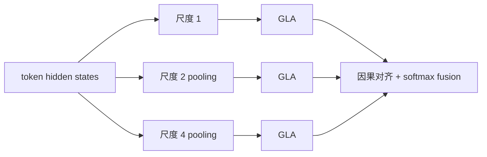
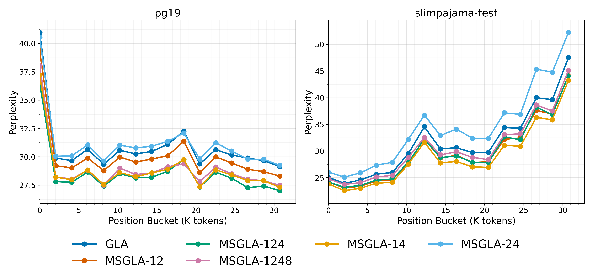

# MS-GLA：多时间尺度门控线性注意力

> **复现级别：L1 架构机制 + 真实 A100 前后向。** 保留多尺度分解、因果 hold 对齐与输入相关融合；未复现论文的 Flash kernel 和等参数训练。

## 论文信息

| 字段 | 内容 |
|---|---|
| 论文链接 | [MS-GLA: Multi-Scale Gated Linear Attention for Addressing Representational Bottlenecks via Multi-Temporal Resolution](https://arxiv.org/abs/2609.35664) |
| 公司 / 机构 | International Institute of Information Technology Hyderabad（第一作者署名单位） |
| 首次公开日期 | 2026-09-28（arXiv v1） |
| 原作者代码 | 是：[prasoondev/msgla](https://github.com/prasoondev/msgla) |
| 本地 adapter / 方法 | `ms-gla` |
| 本地复现代码 | [`src/auto_research/foundation_latest_20260930.py`](https://github.com/daiwk/auto-research/blob/main/src/auto_research/foundation_latest_20260930.py) |

## 原始论文总结

### 背景与主要改动

单一时间分辨率的线性注意力容易形成表征瓶颈。MS-GLA 把 head budget 分配给多个尺度：先做无重叠 masked average pooling，再分别执行 GLA，最后以因果 hold 方式恢复到 token 分辨率，并由输入相关 softmax 路由融合。

<!-- paper-figure:start -->
### 原论文关键图

> **原论文架构图**：展示多尺度序列分支和融合位置。图片来自[原论文](https://arxiv.org/abs/2609.35664)，版权归原作者所有。
<!-- paper-figure:end -->

### 核心公式

本地实现论文式 masked block average；尺度 \(s\) 的块表示只有在块末 token 到达后才可见，杜绝未来信息泄漏。融合权重 \(\alpha_{t,s}=\operatorname{softmax}_s(W_f h_t)\)，输出为 \(\sum_s\alpha_{t,s}\tilde o_{t,s}\)。

### 论文离线与线上效果

论文的语言建模结果和吞吐属于原文数据。本地产物验证 pooling、causal hold、路由归一化与有限梯度，见 [`metrics/mechanism-seeds42-44.json`](metrics/mechanism-seeds42-44.json)。

## 本地复现

`MultiScaleGLA` 是可前后向的紧凑 PyTorch 层；A100 receipt 只证明 CUDA 路径可运行。汇总实验见 [`../../experiments/sep30-p0-p1-mechanisms-seeds42-44.json`](../../experiments/sep30-p0-p1-mechanisms-seeds42-44.json)。

真实 NVIDIA A100 脱敏记录见 [`../../gpu-validations/ms-gla-a100-20260930.json`](../../gpu-validations/ms-gla-a100-20260930.json)。

## 复现边界

当前 recurrent kernel 面向正确性而非吞吐，没有复刻 Triton/Flash 实现或论文参数规模。尚未接入 Evolve，避免把结构名登记误称为已可搜索与公平评价。
