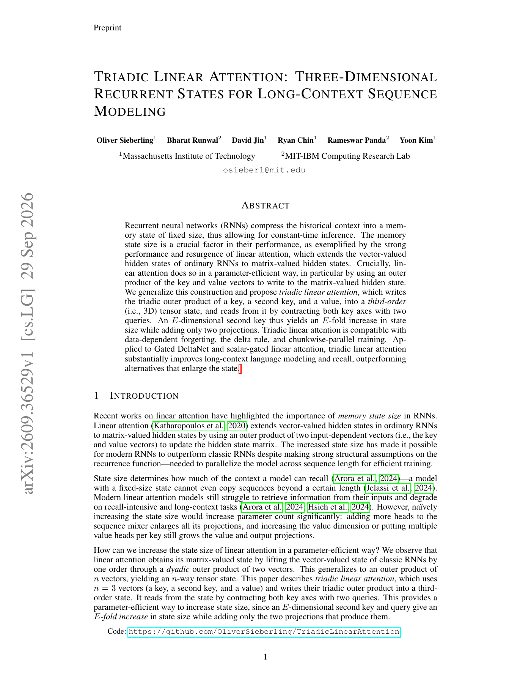

# Triadic Linear Attention：三阶循环状态

> **复现级别：L1 递推机制。** 实现论文 Eq. (2)–(3) 的写入、双 query 收缩和按第二 key 轴衰减。

## 论文信息

| 字段 | 内容 |
|---|---|
| 论文链接 | [arXiv v1](https://arxiv.org/abs/2609.36529) |
| 公司/机构 | MIT / MIT-IBM Watson AI Lab |
| 首次公开日期 | 2026-09-29（arXiv v1） |
| 原文开源代码 | 是：[OliverSieberling/TriadicLinearAttention](https://github.com/OliverSieberling/TriadicLinearAttention) |
| Adapter | `triadic-linear-attention` |
| 本地复现代码 | `src/auto_research/foundation_latest_20260930_followup.py` |

### 背景与主要改动

普通线性注意力写入 $k\otimes v$ 的二维状态；Triadic 再加入第二 key，写入 $k\otimes k'\otimes v$，读取时用 $q,q'$ 收缩两个 key 轴。第二 key 维度为 $E$ 时，状态容量乘以 $E$，只新增两组 projection；$E=1$ 严格退化为普通线性注意力。

<!-- paper-figure:start -->
### 原论文关键图

> 原论文首页包含三阶状态示意与长上下文结果概览。图片来自[原论文](https://arxiv.org/abs/2609.36529)，版权归原作者所有。
<!-- paper-figure:end -->

## 本地复现

`triadic_linear_attention` 是透明的 recurrent reference，测试对照显式求和、检查因果性、$E=1$ 退化与梯度；三种子机制结果见 [`metrics/mechanism-seeds42-44.json`](metrics/mechanism-seeds42-44.json)。未实现论文 Triton chunkwise kernel、Gated DeltaNet upcycling 或长书语言建模，不能把小张量一致性当成论文效果复现。
