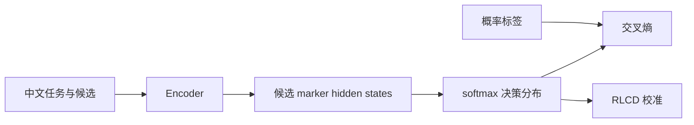
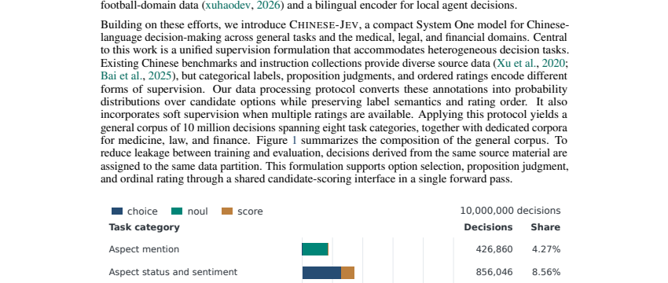

# Chinese-Jev：中文 System One 决策模型

> **复现级别：L1 目标函数与模型头。** 实现候选 marker 表示、候选概率监督与 RLCD 风格校准项；未训练论文 1000 万样本模型。

## 论文信息

| 字段 | 内容 |
|---|---|
| 论文链接 | [Chinese-Jev](https://arxiv.org/abs/2609.36965) |
| 公司 / 机构 | 复旦大学（第一作者署名单位） |
| 首次公开日期 | 2026-09-29（arXiv v1） |
| 原作者代码 | 尚未发布独立仓库；[项目页](https://gulucaptain.github.io/Chinese-Jev/)称将发布模型、数据和代码 |
| 本地 adapter / 方法 | `chinese-jev` |
| 本地复现代码 | [`src/auto_research/foundation_latest_20260930.py`](https://github.com/daiwk/auto-research/blob/main/src/auto_research/foundation_latest_20260930.py) |

## 原始论文总结

### 背景与主要改动

Chinese-Jev 面向分类、路由、候选选择等封闭输出任务，用轻量 encoder 读取中文上下文和候选项，以各候选 marker 的隐藏状态直接评分。异构标注统一成候选概率分布，先做 1000 万条通用预训练，再按医疗、法律、金融分别微调。

<!-- paper-figure:start -->
### 原论文关键图

> 原论文 Figure 1，展示通用中文决策数据构成；版权归原作者所有。
<!-- paper-figure:end -->

### 核心公式

候选 $i$ 的分数为 $s_i=w^\top h_{m_i}$，$p_i=\mathrm{softmax}(s)_i$；本地目标组合软标签交叉熵 $-\sum_i q_i\log p_i$ 与以 reward-centered advantage 加权的 $-\log p_i$，保持论文“候选决策而非自回归生成”的核心边界。

### 论文效果

论文报告通用任务准确率较闭源 Jev 高 1.24%、速度快 20.3 倍；领域微调后医疗高 4.0%，并报告约 15ms 平均延迟。这些均为原论文结果。本地三种子机制指标见 [`metrics/mechanism-seeds42-44.json`](metrics/mechanism-seeds42-44.json)。

## 本地复现与边界

`ChineseJevHead` 可前后向并验证概率归一化和有限梯度；没有论文数据、完整 backbone、移动端 INT8 部署或论文级性能对照。
