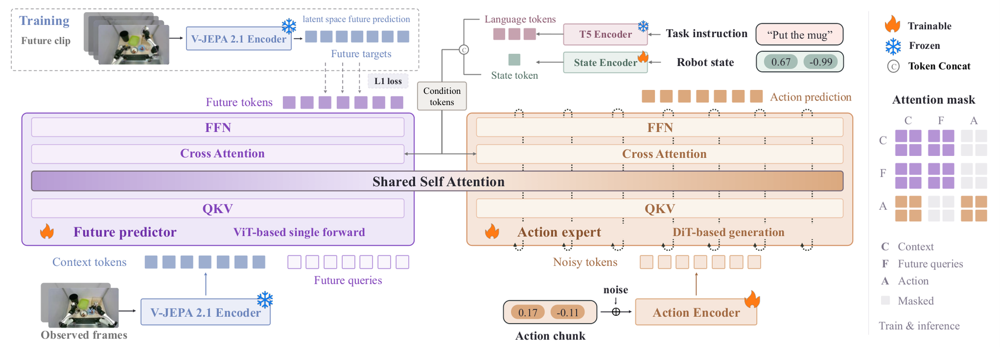

# V-JEPA Policy: Building Effective World-Action Models on Predictive Visual Latents

> **复现级别：L1 核心机制诊断。** 执行 future-latent stop-gradient 与 action flow matching；未加载 V-JEPA 2.1 或机器人数据。

## 论文信息

| 字段 | 内容 |
|---|---|
| 论文链接 | [arXiv 2609.37250](https://arxiv.org/abs/2609.37250) |
| 公司/机构 | Tsinghua University（按第一作者署名单位） |
| 首次公开日期 | 2026-09-29（arXiv v1） |
| 原文开源代码 | 是：[https://github.com/breez3young/VJEPA-Policy](https://github.com/breez3young/VJEPA-Policy) |
| Adapter | `vjepa-policy` |
| 本地复现代码 | [`src/auto_research/foundation_latest_20261001.py`](https://github.com/daiwk/auto-research/blob/main/src/auto_research/foundation_latest_20261001.py) |

## 原始论文总结

### 背景与主要改动

冻结 V-JEPA 2.1 视觉编码器，在预测视觉潜空间中联合训练 instruction-conditioned future-latent predictor 和 flow-matching action expert；动作生成读取 predictor 的未来信息上下文。

<!-- paper-figure:start -->
### 原论文关键图

> **原论文 Figure 1（关键图）**：展示原论文方法的总体设计和关键组成。图片来自[原论文](https://arxiv.org/abs/2609.37250)，版权归原作者所有；点击图片可查看来源。
<!-- paper-figure:end -->

### 核心公式

$L_{predict}=|M|^{-1}\sum_{i\in M}\|P(E(x),q)_i-sg(E(y)_i)\|_1$，并联合 flow-matching action velocity loss。

### 论文离线与线上效果

0.9B 总参数（0.6B 可训练）在 LIBERO、LIBERO-Plus、RoboCasa-GR1 与代表性 WAM/VLA 竞争；本地不运行机器人 checkpoint。

## 本地复现

> **本地对照口径**：基线为论文机制关闭或默认状态，实验组为开启对应核心算子；本批只验证不变量和状态转换，跨模型相对变化不适用。

三种子诊断见 [`metrics/mechanism-seeds42-44.json`](metrics/mechanism-seeds42-44.json)。`diagnostic_only=true`，只证明核心状态转换、梯度或调度不变量可执行，不能进入正式能力排名。

## 复现边界

执行 future-latent stop-gradient 与 action flow matching；未加载 V-JEPA 2.1 或机器人数据。
