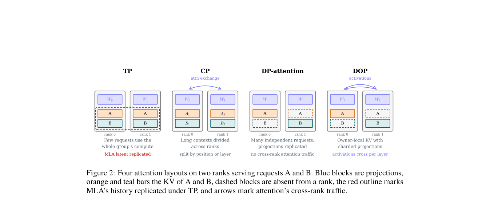

# SPLASH: Switching Parallel Layouts of Attention with Seamless Handoff for LLM Serving

> **复现级别：L1 核心机制诊断。** 执行内存模型和 transition-aware layout planner；未实现 CUDA handoff，也不声称经过 B200/H200 性能验证。

## 论文信息

| 字段 | 内容 |
|---|---|
| 论文链接 | [arXiv 2609.37626](https://arxiv.org/abs/2609.37626) |
| 公司/机构 | Institute of Computing Technology, Chinese Academy of Sciences（按第一作者署名单位） |
| 首次公开日期 | 2026-09-29（arXiv v1） |
| 原文开源代码 | 是：[https://github.com/ict-agent/SPLASH-sglang](https://github.com/ict-agent/SPLASH-sglang) |
| Adapter | `splash` |
| 本地复现代码 | [`src/auto_research/foundation_latest_20261001.py`](https://github.com/daiwk/auto-research/blob/main/src/auto_research/foundation_latest_20261001.py) |

## 原始论文总结

### 背景与主要改动

统一描述 attention weight 与 KV cache 的所有权，引入权重分片、请求独占 KV 的 DOP；调度器把布局切换成本按剩余步数摊销，在 TP、DP、CP、DOP 间在线切换。

<!-- paper-figure:start -->
### 原论文关键图

> **原论文 Figure 2（关键图）**：展示原论文方法的总体设计和关键组成。图片来自[原论文](https://arxiv.org/abs/2609.37626)，版权归原作者所有；点击图片可查看来源。
<!-- paper-figure:end -->

### 核心公式

$M_{TP}=W_A/T+Bks$，$M_{DOP}=W_A/T+Bks/T$，$M_{DP}=M_{CP}=W_A+Bks/T$；调度目标额外摊销 switch cost。

### 论文离线与线上效果

B200/GLM-5.3 上端到端吞吐为固定布局的 1.3–1.73 倍，切换中位开销低于所在 step 的 0.51%；A100/A30 不冒充论文硬件结果。

## 本地复现

> **本地对照口径**：基线为论文机制关闭或默认状态，实验组为开启对应核心算子；本批只验证不变量和状态转换，跨模型相对变化不适用。

三种子诊断见 [`metrics/mechanism-seeds42-44.json`](metrics/mechanism-seeds42-44.json)。`diagnostic_only=true`，只证明核心状态转换、梯度或调度不变量可执行，不能进入正式能力排名。

## 复现边界

执行内存模型和 transition-aware layout planner；未实现 CUDA handoff，也不声称经过 B200/H200 性能验证。
