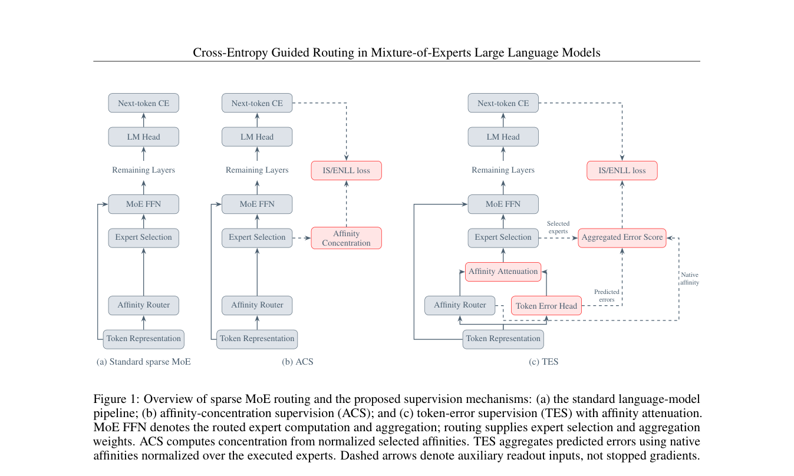

# Cross-Entropy Guided Routing in Mixture-of-Experts Large Language Models

> **复现级别：L1 核心机制诊断。** 执行 error-aware routing 公式；未训练 Granite MoE。

## 论文信息

| 字段 | 内容 |
|---|---|
| 论文链接 | [arXiv 2609.37751](https://arxiv.org/abs/2609.37751) |
| 公司/机构 | Bar-Ilan University（按第一作者署名单位） |
| 首次公开日期 | 2026-09-29（arXiv v1） |
| 原文开源代码 | 否：截至 2026-10-01 未找到原作者公开仓库 |
| Adapter | `ce-guided-moe` |
| 本地复现代码 | [`src/auto_research/foundation_latest_20261001.py`](https://github.com/daiwk/auto-research/blob/main/src/auto_research/foundation_latest_20261001.py) |

## 原始论文总结

### 背景与主要改动

在原生 MoE affinity 旁增加逐 expert token-error head，并用预测误差的 started-log 对路由 logit 做衰减；高预测错误的 expert 在 Top-K 前被降权，同时误差头由真实 next-token CE 监督。

<!-- paper-figure:start -->
### 原论文关键图

> **原论文 Figure 1（关键图）**：展示原论文的整体流程、关键阶段及其数据流向。图片来自[原论文](https://arxiv.org/abs/2609.37751)，版权归原作者所有；点击图片可查看来源。
<!-- paper-figure:end -->

### 核心公式

$\tilde a_{t,i}=a_{t,i}-\gamma\log(1+\hat e_{t,i}/\tau)$，再对 $\tilde a$ 做 softmax 与 Top-K。

### 论文离线与线上效果

Granite MoE 实验报告平均约 2.3 个百分点提升；本地只验证误差感知 affinity 衰减。

## 本地复现

> **本地对照口径**：基线为论文机制关闭或默认状态，实验组为开启对应核心算子；本批只验证不变量和状态转换，跨模型相对变化不适用。

三种子诊断见 [`metrics/mechanism-seeds42-44.json`](metrics/mechanism-seeds42-44.json)。`diagnostic_only=true`，只证明核心状态转换、梯度或调度不变量可执行，不能进入正式能力排名。

## 复现边界

执行 error-aware routing 公式；未训练 Granite MoE。
