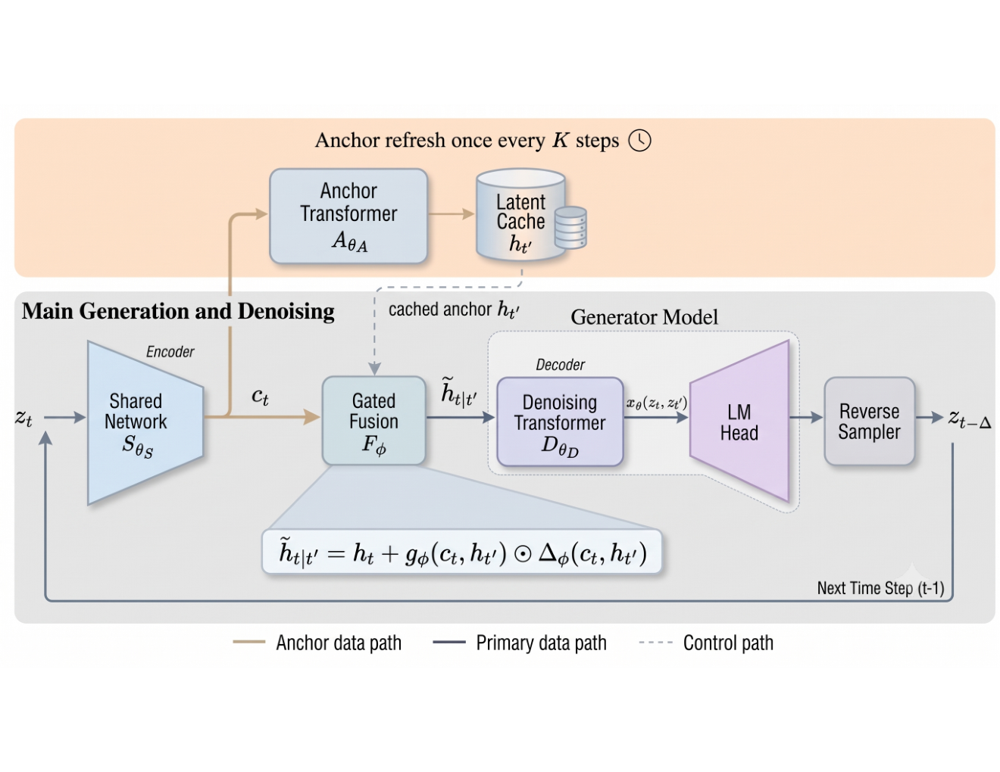

# Time-Anchored Diffusion Language Models: Latent-Space Caching for Fast Generation

> **复现级别：L1 核心机制诊断。** 执行 stale-anchor 门控修正；未加载 DiffusionGemma-26B。

## 论文信息

| 字段 | 内容 |
|---|---|
| 论文链接 | [arXiv 2609.37924](https://arxiv.org/abs/2609.37924) |
| 公司/机构 | The University of Texas at Austin（按第一作者署名单位） |
| 首次公开日期 | 2026-09-29（arXiv v1） |
| 原文开源代码 | 否：截至 2026-10-01 未找到原作者公开仓库 |
| Adapter | `tadm` |
| 本地复现代码 | [`src/auto_research/foundation_latest_20261001.py`](https://github.com/daiwk/auto-research/blob/main/src/auto_research/foundation_latest_20261001.py) |

## 原始论文总结

### 背景与主要改动

将昂贵 anchor network 的潜表示跨多个反向扩散步缓存，只周期性刷新；小型 fusion module 根据当前状态门控修正陈旧 anchor，再交给轻量 denoiser。

<!-- paper-figure:start -->
### 原论文关键图

> **原论文 Figure 1（关键图）**：展示原论文方法的总体设计和关键组成。图片来自[原论文](https://arxiv.org/abs/2609.37924)，版权归原作者所有；点击图片可查看来源。
<!-- paper-figure:end -->

### 核心公式

$\tilde h_{t|t'}=h_{t'}+g_\phi(c_t,h_{t'})\odot\Delta_\phi(c_t,h_{t'})$。本地实现门控 cache correction。

### 论文离线与线上效果

DiffusionGemma-26B 后训练版吞吐提高约 49%–79%；预训练版最多减少 38% Transformer 层计算，并比 ADLM 测得吞吐最高提高 73%。

## 本地复现

> **本地对照口径**：基线为论文机制关闭或默认状态，实验组为开启对应核心算子；本批只验证不变量和状态转换，跨模型相对变化不适用。

三种子诊断见 [`metrics/mechanism-seeds42-44.json`](metrics/mechanism-seeds42-44.json)。`diagnostic_only=true`，只证明核心状态转换、梯度或调度不变量可执行，不能进入正式能力排名。

## 复现边界

执行 stale-anchor 门控修正；未加载 DiffusionGemma-26B。
