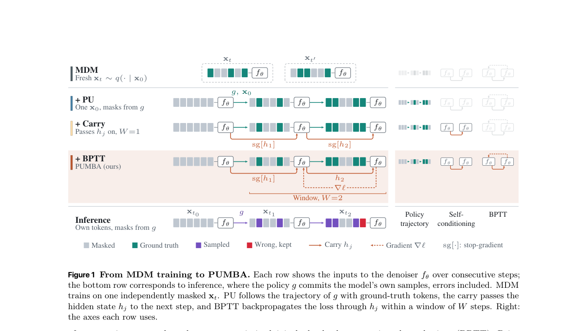

# On Trajectory-Aware Training for Masked Diffusion Language Models

> **复现级别：L1 核心机制诊断。** 执行连续 denoising carry 与窗口内 BPTT；未训练 LLaDA-8B。

## 论文信息

| 字段 | 内容 |
|---|---|
| 论文链接 | [arXiv 2609.37974](https://arxiv.org/abs/2609.37974) |
| 公司/机构 | Apple（按第一作者署名单位） |
| 首次公开日期 | 2026-09-29（arXiv v1） |
| 原文开源代码 | 否：截至 2026-10-01 未找到原作者公开仓库 |
| Adapter | `pumba` |
| 本地复现代码 | [`src/auto_research/foundation_latest_20261001.py`](https://github.com/daiwk/auto-research/blob/main/src/auto_research/foundation_latest_20261001.py) |

## 原始论文总结

### 背景与主要改动

训练时沿模型自己的 progressive-unmasking 轨迹连续展开多个 denoising step，把隐藏 carry 传给下一步，并在固定窗口内通过时间反向传播，使前一步学会产生对后续有用的 carry。

<!-- paper-figure:start -->
### 原论文关键图

> **原论文 Figure 1（关键图）**：展示原论文的训练流程与关键优化环节。图片来自[原论文](https://arxiv.org/abs/2609.37974)，版权归原作者所有；点击图片可查看来源。
<!-- paper-figure:end -->

### 核心公式

$L_W=W^{-1}\sum_{j=1}^W CE(f_\theta(x_{t_j},h_{j-1}),x_0)$，梯度在窗口内穿过 carry，窗口间截断。

### 论文离线与线上效果

LLaDA-8B 在保持质量时减少约 22%–26% function evaluations；本地只验证窗口内 BPTT。

## 本地复现

> **本地对照口径**：基线为论文机制关闭或默认状态，实验组为开启对应核心算子；本批只验证不变量和状态转换，跨模型相对变化不适用。

三种子诊断见 [`metrics/mechanism-seeds42-44.json`](metrics/mechanism-seeds42-44.json)。`diagnostic_only=true`，只证明核心状态转换、梯度或调度不变量可执行，不能进入正式能力排名。

## 复现边界

执行连续 denoising carry 与窗口内 BPTT；未训练 LLaDA-8B。
