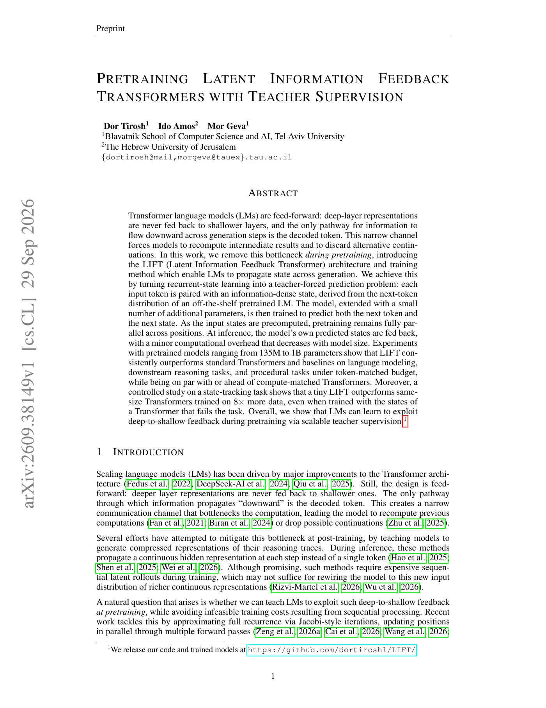

# LIFT：预训练阶段的潜状态反馈

> **复现级别：L1 核心机制。** 实现 top-k 分布状态、token/state SwiGLU 融合和 CE + state KL；未训练 135M–1B 模型。

## 论文信息

| 字段 | 内容 |
|---|---|
| 论文链接 | [arXiv v1](https://arxiv.org/abs/2609.38149) |
| 公司/机构 | Tel Aviv University（第一作者） |
| 首次公开日期 | 2026-09-29（arXiv v1） |
| 原文开源代码 | 是：[dortirosh1/LIFT](https://github.com/dortirosh1/LIFT) |
| Adapter | `lift-feedback` |
| 本地复现代码 | `src/auto_research/foundation_latest_20260930_followup.py` |

### 背景与主要改动

普通 Transformer 的深层信息只能通过下一个离散 token 回到浅层。LIFT 把 teacher 的下一 token top-k 分布预计算成连续状态；训练时 token 与 teacher state 并行输入，同时预测下一 token 和下一 state；推理时改用模型自己的 state。核心目标是 token CE 加 teacher top-k 分布的前向 KL。

<!-- paper-figure:start -->
### 原论文关键图

> 原论文 Figure 1，展示 Transformer 信息瓶颈、teacher-forced 训练和推理时状态回灌。图片来自[原论文](https://arxiv.org/abs/2609.38149)，版权归原作者所有。
<!-- paper-figure:end -->

## 本地复现

`lift_topk_state` 保留并归一化 top-k logits；`lift_fuse` 用共享 embedding 投影 state 并做 residual SwiGLU；`lift_loss` 组合两个目标。测试覆盖稀疏归一化、反馈改变输出及 teacher stop-gradient；三种子机制结果见 [`metrics/mechanism-seeds42-44.json`](metrics/mechanism-seeds42-44.json)。没有大规模预训练、prefix state dropout 或论文 benchmark，因此只是机制验证。
