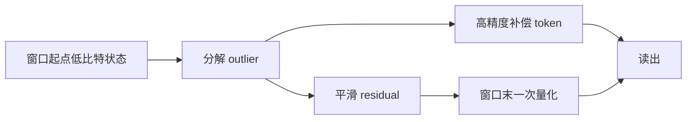
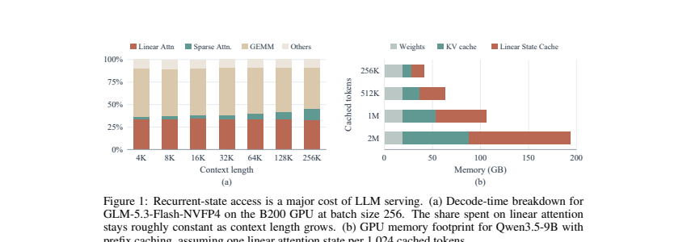

# LeapQuant：窗口量化与补偿 token

> **复现级别：L1 机制实现。** 保留 per-window state quantization、低秩补偿 token 与 residual smoothing；未复刻论文 CUDA kernel 和完整模型吞吐。

## 论文信息

| 字段 | 内容 |
|---|---|
| 论文链接 | [LeapQuant](https://arxiv.org/abs/2609.38166) |
| 公司 / 机构 | UC Berkeley（第一作者署名单位） |
| 首次公开日期 | 2026-09-29（arXiv v1） |
| 原作者代码 | 否：截至 2026-09-30，论文未给出原作者仓库 |
| 本地 adapter / 方法 | `leapquant` |
| 本地复现代码 | [`src/auto_research/foundation_latest_20260930.py`](https://github.com/daiwk/auto-research/blob/main/src/auto_research/foundation_latest_20260930.py) |

## 原始论文总结

### 背景与主要改动

逐 token 量化递归状态会不断重新舍入。LeapQuant 在一个窗口内保留低比特基态，并以高精度缓冲本窗口更新，窗口末才量化一次；同时把最大 outlier 分解成少量高精度 compensator tokens，对剩余状态平滑后再量化。

<!-- paper-figure:start -->
### 原论文关键图

> 原论文 Figure 1，展示递归状态访问的 decoding 开销。图片来自[原论文](https://arxiv.org/abs/2609.38166)，版权归原作者所有。
<!-- paper-figure:end -->

### 核心公式

窗口内状态写成 $S_t=Q(S_{kw})+\sum_{i=kw+1}^{t}\Delta S_i$，只在边界 $t=(k+1)w$ 重量化；本地用截断 SVD 构造 rank-$r$ 补偿项 $C=U_r\Sigma_rV_r^\top$，对 $S-C$ 对称量化，再把 $C$ 加回读出。

### 论文离线与线上效果

论文在 Qwen/Kimi/GLM 家族报告接近 FP32 的 8-bit 结果、kernel 级 2.05–3.70 倍加速和端到端 1.47 倍加速。本站不复述为本地结果；本地指标见 [`metrics/mechanism-seeds42-44.json`](metrics/mechanism-seeds42-44.json)。

## 本地复现与边界

机制诊断覆盖窗口边界、补偿 rank、状态误差及 CUDA 执行；未实现作者专用 kernel。A100 脱敏记录见 [`../../gpu-validations/leapquant-a100-20260930.json`](../../gpu-validations/leapquant-a100-20260930.json)。
