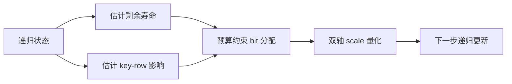
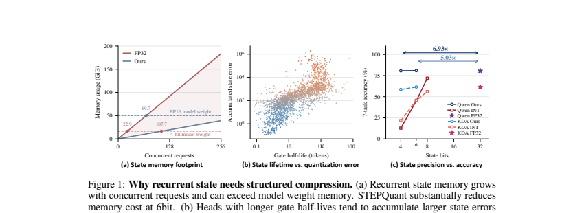

# STEPQuant：线性注意力递归状态的时空量化

> **复现级别：L1 机制实现。** 本地实现寿命感知 bit 分配与行/列双轴 scale 拟合；未复刻 SGLang kernel、Qwen3.8/Kimi-Linear 全模型吞吐。

## 论文信息

| 字段 | 内容 |
|---|---|
| 论文链接 | [STEPQuant](https://arxiv.org/abs/2609.38169) |
| 公司 / 机构 | 浙江大学（第一作者署名单位） |
| 首次公开日期 | 2026-09-29（arXiv v1） |
| 原作者代码 | 是：[Dreamer-Toby/STEPQuant](https://github.com/Dreamer-Toby/STEPQuant) |
| 本地 adapter / 方法 | `stepquant` |
| 本地复现代码 | [`src/auto_research/foundation_latest_20260930.py`](https://github.com/daiwk/auto-research/blob/main/src/auto_research/foundation_latest_20260930.py) |

## 原始论文总结

### 背景与主要改动

Delta-rule 线性注意力的固定大小状态会被每个并发请求长期持有，统一低比特量化又会让误差随更新累积。STEPQuant 同时建模状态记忆的剩余寿命和不同 key row 对输出的影响：在固定平均 bit 预算下给重要块更高精度，再用 key-row / value-column 两组 scale 拟合状态分布。

<!-- paper-figure:start -->
### 原论文关键图

> 原论文 Figure 1，展示状态内存、记忆寿命与量化误差的关系。图片来自[原论文](https://arxiv.org/abs/2609.38169)，版权归原作者所有。
<!-- paper-figure:end -->

### 核心公式

本地先以归一化寿命权重 $w_t=(T-t)/\sum_j(T-j)$ 衡量时间传播风险，再在候选 bit 集合上精确求解 $\min\sum_i w_i e_{i,b_i}$，满足平均 bit 预算；最终以行、列 scale 的几何组合量化状态。实现保留了论文的“何时重要 + 何处重要”两轴，而不是把名字映射到统一 INT8。

### 论文离线与系统效果

论文在 Qwen3.8-27B 与 Kimi-Linear-48B-A3B-Instruct 上报告：名义 6 bit 接近 FP32 state，状态压缩超过 5 倍、总 serving 内存最多下降 68.7%。这些是论文数据。本站三种子机制诊断见 [`metrics/mechanism-seeds42-44.json`](metrics/mechanism-seeds42-44.json)。

## 本地复现与边界

本地验证 bit 预算、有限 scale、递归状态 MSE 和 CUDA 前后向；不声称复现论文吞吐或精度。A100 脱敏记录见 [`../../gpu-validations/stepquant-a100-20260930.json`](../../gpu-validations/stepquant-a100-20260930.json)。
