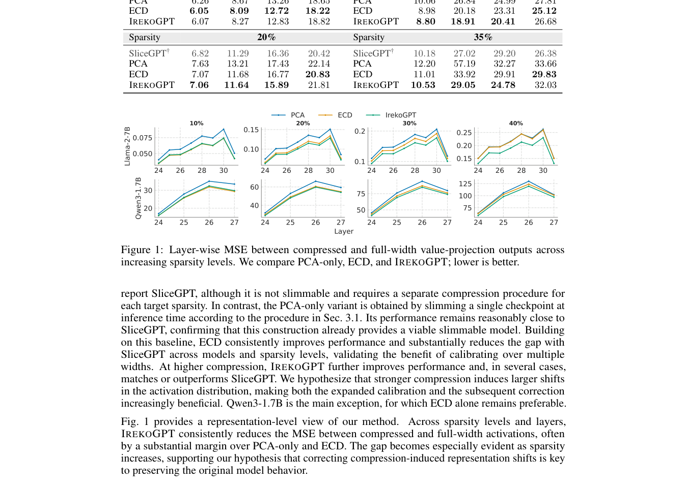

# IrekoGPT: Turning Structured Pruning into Post-Hoc Slimmable LLMs

> **复现级别：L1 核心机制诊断。** 执行嵌套子网合同；未加载原模型或复现吞吐。

## 论文信息

| 字段 | 内容 |
|---|---|
| 论文链接 | [arXiv v1](https://arxiv.org/abs/2610.00426) |
| 公司/机构 | University of Modena and Reggio Emilia（按第一作者署名单位） |
| 首次公开日期 | 2026-10-01（arXiv v1） |
| 原文开源代码 | 是：[https://github.com/aimagelab/IrekoGPT](https://github.com/aimagelab/IrekoGPT) |
| Adapter | `irekogpt` |
| 本地复现代码 | [`src/auto_research/foundation_latest_20261003.py`](https://github.com/daiwk/auto-research/tree/main/src/auto_research/foundation_latest_20261003.py) |

## 原始论文总结

### 背景与主要改动

保留 SliceGPT 投影矩阵而非直接丢弃，使同一 checkpoint 暴露嵌套宽度；再以多压缩率校准和 ridge 修正下游线性层。

<!-- paper-figure:start -->
### 原论文关键图

> **原论文 Figure 1（关键图）**：展示原论文方法的总体设计和关键组成。图片来自[原论文](https://arxiv.org/abs/2610.00426)，版权归原作者所有；点击图片可查看来源。
<!-- paper-figure:end -->

### 核心公式

$W_k=P_{:k}^TWP_{:k}$，不同 k 共享同一嵌套基。

### 论文离线与线上效果

Llama/Qwen 初步实验在高压缩率下优于朴素 PCA slimming。

## 本地复现

> **本地对照口径**：基线为机制关闭或默认状态，实验组执行定义性算子；L1 不报告正式相对提升，百分比不适用。

- 三种子诊断：[`metrics/mechanism-seeds42-44.json`](metrics/mechanism-seeds42-44.json)
- `diagnostic_only=true`，不进入正式能力排名。

## 复现边界

执行嵌套子网合同；未加载原模型或复现吞吐。
