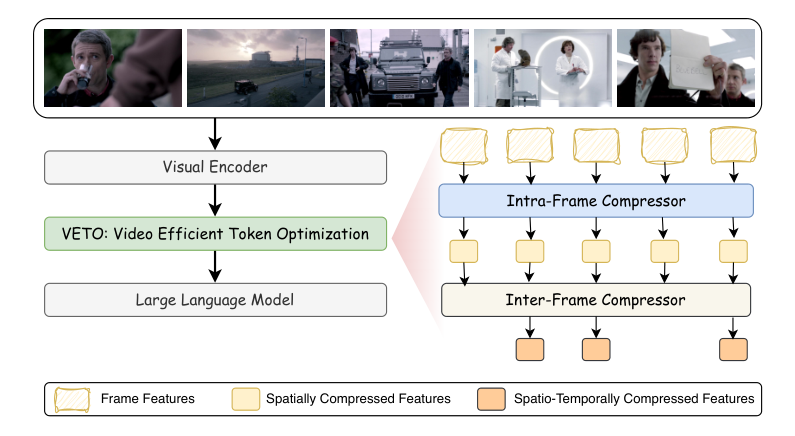

# VETO: Video Efficient Token Optimization for Vision Language Models

> **复现级别：L1 核心机制诊断。** 执行 GPU 上空间先行、时间后继的双轴压缩；未加载 7B VLM、真实视频 benchmark 或复述论文吞吐为本地结果。

## 论文信息

| 字段 | 内容 |
|---|---|
| 论文链接 | [arXiv 2610.01785](https://arxiv.org/abs/2610.01785) |
| 公司/机构 | National Taiwan University（按第一作者署名单位） |
| 首次公开日期 | 2026-10-01（arXiv v1） |
| 原文开源代码 | 否：截至 2026-10-02 未找到原作者公开实现 |
| Adapter | `veto` |
| 本地复现代码 | [`src/auto_research/foundation_latest_20261002.py`](https://github.com/daiwk/auto-research/blob/main/src/auto_research/foundation_latest_20261002.py) |

## 原始论文总结

### 背景与主要改动

先在帧内合并语义近邻 token，再对压缩后的 frame representation 做跨帧去冗余；空间先行显著降低全局时间匹配成本。

<!-- paper-figure:start -->
### 原论文关键图

> **原论文关键图**：展示论文核心架构、训练流程或系统协议。图片来自[原论文](https://arxiv.org/abs/2610.01785)，版权归原作者所有；点击图片可查看来源。
<!-- paper-figure:end -->

### 核心公式

$X'=C_{time}(C_{space}(X))$；本地用确定性最远点代表验证双轴顺序与预算。

### 论文离线与线上效果

LLaVA-OneVision-7B 推理最高快 45%；10% token 预算下准确率 55.7%。

## 本地复现

> **本地对照口径**：基线为机制关闭或默认状态，实验组为开启对应核心算子；相对百分比不适用。本批指标只验证不变量、梯度或状态转换，不表示论文规模效果。

- 三种子诊断：[`metrics/mechanism-seeds42-44.json`](metrics/mechanism-seeds42-44.json)
- `diagnostic_only=true`，不进入正式能力排名。
- GPU 验证：[`docs/gpu-validations/veto-a100-20261002.json`](https://github.com/daiwk/auto-research/blob/main/docs/gpu-validations/veto-a100-20261002.json)

## 复现边界

执行 GPU 上空间先行、时间后继的双轴压缩；未加载 7B VLM、真实视频 benchmark 或复述论文吞吐为本地结果。
