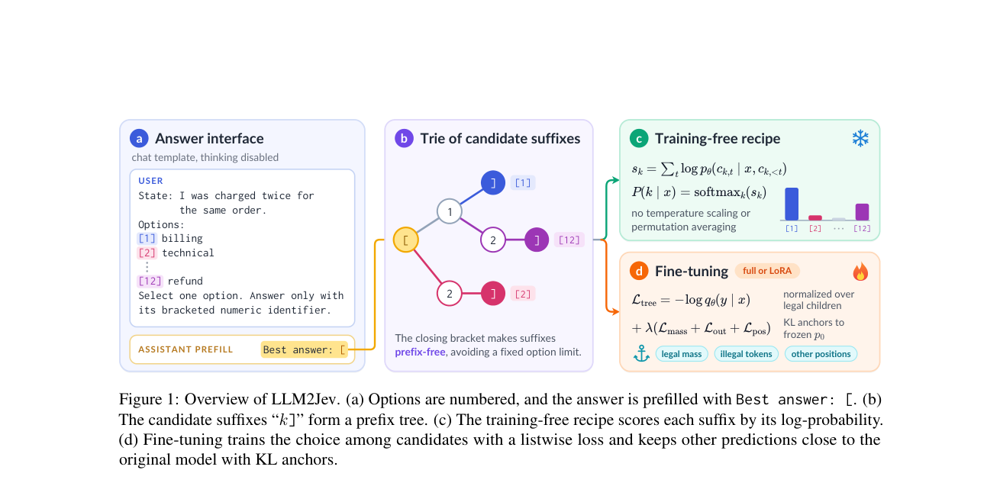

# LLM2Jev: LLMs Are Already Jev-Style Decision Models -- When and How to Fine-Tune Them

> **复现级别：L1 核心机制诊断。** 执行候选联合打分和 KL 锚定；未加载 4B checkpoint 或跑 JevBench。

## 论文信息

| 字段 | 内容 |
|---|---|
| 论文链接 | [arXiv v1](https://arxiv.org/abs/2610.02076) |
| 公司/机构 | Microsoft（按作者邮箱）（按第一作者署名单位） |
| 首次公开日期 | 2026-10-01（arXiv v1） |
| 原文开源代码 | 否：截至 2026-10-03 未找到原作者公开实现 |
| Adapter | `llm2jev` |
| 本地复现代码 | [`src/auto_research/foundation_latest_20261003.py`](https://github.com/daiwk/auto-research/tree/main/src/auto_research/foundation_latest_20261003.py) |

## 原始论文总结

### 背景与主要改动

直接从括号数字选项的 next-token 概率形成有限类别分布；微调时使用 listwise 决策损失，并以 KL 锚定基础模型辅助输出。

<!-- paper-figure:start -->
### 原论文关键图

> **原论文 Figure 1（关键图）**：展示原论文的训练流程与关键优化环节。图片来自[原论文](https://arxiv.org/abs/2610.02076)，版权归原作者所有；点击图片可查看来源。
<!-- paper-figure:end -->

### 核心公式

$p(o)\propto\exp\sum_t\log p([o]_t)$，$L=L_{list}+\lambda KL(p_{base}\|p_{aux})$。

### 论文离线与线上效果

Qwen3.5-4B 无训练即可匹配同骨干社区 Jev 模型，微调收益主要集中在弱项。

## 本地复现

> **本地对照口径**：基线为机制关闭或默认状态，实验组执行定义性算子；L1 不报告正式相对提升，百分比不适用。

- 三种子诊断：[`metrics/mechanism-seeds42-44.json`](metrics/mechanism-seeds42-44.json)
- `diagnostic_only=true`，不进入正式能力排名。

## 复现边界

执行候选联合打分和 KL 锚定；未加载 4B checkpoint 或跑 JevBench。
