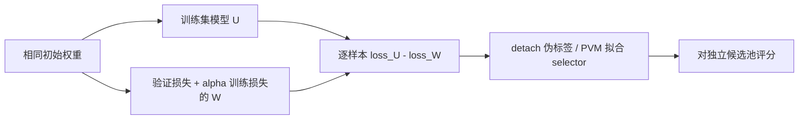
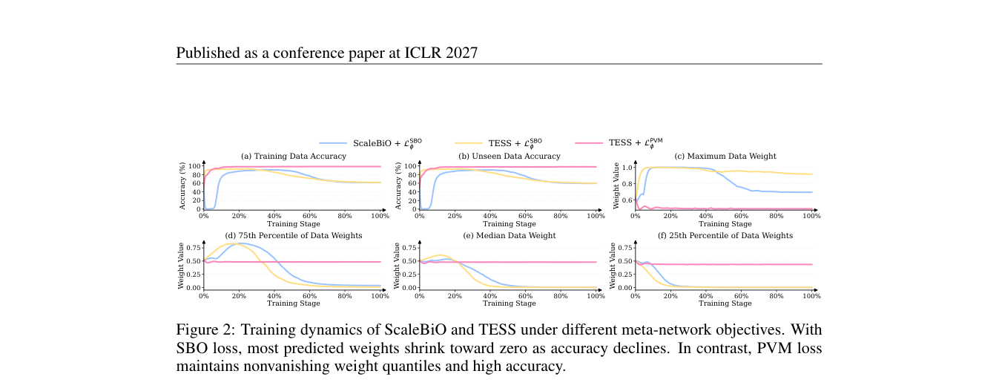

# TESS：可迁移的数据选择元网络

> **L1 顺序训练与选样目标诊断**：真实训练两份小模型和 selector；没有声称复现大模型数据选择收益。

## 论文信息

| 字段 | 内容 |
|---|---|
| 论文链接 | [arXiv 2610.02092](https://arxiv.org/abs/2610.02092) |
| 公司/机构 | Nanyang Technological University（一作 Zilin Du） |
| 首次公开日期 | 2026-10-01（arXiv v1） |
| 原文开源代码 | 未找到作者公开代码（2026-10-04 全文核查）；文中 Alpaca 数据链接不是方法实现 |
| Adapter | `tess`（Python 机制 API） |
| 本地复现代码 | [`src/auto_research/post_training/tess.py`](https://github.com/daiwk/auto-research/blob/main/src/auto_research/post_training/tess.py) |

## 原始论文总结

### 背景与主要改动

先分别训练仅看训练集的模型和加入验证集指导的模型，以两者逐样本损失差构造价值伪标签；再用 pointwise value matching 训练数据 selector。避免直接选择目标的病态优化，并让小规模教师产生的选样规则迁移到更大的未见数据池。

<!-- paper-figure:start -->
### 原论文关键图

> **原论文 Figure 2（关键图）**：展示原论文的训练流程与关键优化环节。图片来自[原论文](https://arxiv.org/abs/2610.02092)，版权归原作者所有；点击图片可查看来源。
<!-- paper-figure:end -->

### 核心公式

$U=\operatorname{Train}(D_{train})$，$W=\operatorname{Train}(L_{val}+\alpha L_{train})$。
$\Delta_i=\ell(U;x_i)-\ell(W;x_i)$；$L_{PVM}=N^{-1}\sum_i(g_\psi(x_i)-\operatorname{stopgrad}(\Delta_i))^2$。
两模型从相同初始权重开始、顺序训练，保存逐样本损失后释放模型。不得把 test 当 validation 使用。

### 论文离线与线上效果

论文研究跨数据池和模型规模的可迁移数据选择及 PVM 与直接元目标的区别；未报告生产线上 A/B。真实 LLM 数据选择表现需要额外下游训练验证，不能用 selector 的拟合损失代替。

## 本地复现

`PYTHONPATH=src python scripts/run_oct04_seven_papers.py` 生成互不重用的 64 个训练、32 个验证、48 个池样本；两分类器各训练 60 步、selector 120 步，三 seed。

[产物](metrics/mechanism-seeds42-44.json)：PVM 平均损失由 0.0803 降到 0.0129，48 个池样本得到非恒定分数。没有读取 test，也没有报告 test 准确率。

`fit_tess` 接受 `per_example_loss(model,batch)`，因此可显式对接 token 平均语言模型损失；对源模型初始参数保持不变，伪标签不反传。输出分数可能为负，不应未经转换当作采样概率；本次没有偷偷 clamp 目标为非负。

## 复现边界

本地二维合成分类特征代替论文语言模型和指令样本特征；只验证顺序训练、伪标签和 selector 学习。完整 LLM 数据池评分、重训练及质量收益尚未验证，不作为正式 Evolve 数据选择算子。
