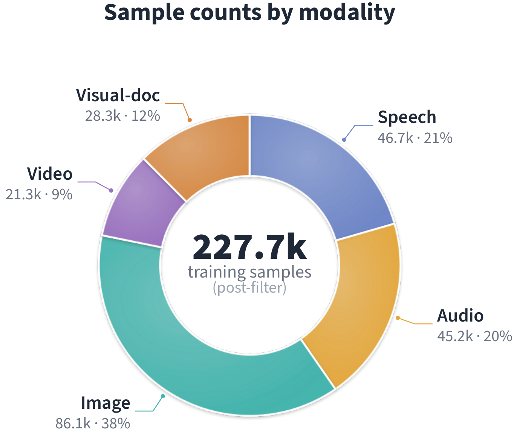

# Omni-Embed-Mini: Binding Modalities Without Forgetting via Dense Distillation

> **复现级别：L1 核心机制诊断。** 执行同几何空间的稠密描述蒸馏；未训练模态编码器或复现实测榜单。

## 论文信息

| 字段 | 内容 |
|---|---|
| 论文链接 | [arXiv v1](https://arxiv.org/abs/2610.02148) |
| 公司/机构 | 原文首页未列第一作者机构（按第一作者署名单位） |
| 首次公开日期 | 2026-10-01（arXiv v1） |
| 原文开源代码 | 否：截至 2026-10-03 未找到原作者公开实现 |
| Adapter | `omni-embed-mini` |
| 本地复现代码 | [`src/auto_research/foundation_latest_20261003.py`](https://github.com/daiwk/auto-research/tree/main/src/auto_research/foundation_latest_20261003.py) |

## 原始论文总结

### 背景与主要改动

冻结文本骨干，把每个媒体样本的稠密级联描述经同一文本骨干得到 teacher target，再训练轻量投影器和分阶段 LoRA 对齐六种模态。

<!-- paper-figure:start -->
### 原论文关键图

> **原论文 Figure 2（关键图）**：展示原论文的训练流程与关键优化环节。图片来自[原论文](https://arxiv.org/abs/2610.02148)，版权归原作者所有；点击图片可查看来源。
<!-- paper-figure:end -->

### 核心公式

$L_{distill}=1-\cos(z_{media},stopgrad(z_{caption}))$。

### 论文离线与线上效果

0.9B 模型覆盖文本、语音、音频、图像、视频和富文档且保持文本检索能力。

## 本地复现

> **本地对照口径**：基线为机制关闭或默认状态，实验组执行定义性算子；L1 不报告正式相对提升，百分比不适用。

- 三种子诊断：[`metrics/mechanism-seeds42-44.json`](metrics/mechanism-seeds42-44.json)
- `diagnostic_only=true`，不进入正式能力排名。

## 复现边界

执行同几何空间的稠密描述蒸馏；未训练模态编码器或复现实测榜单。
