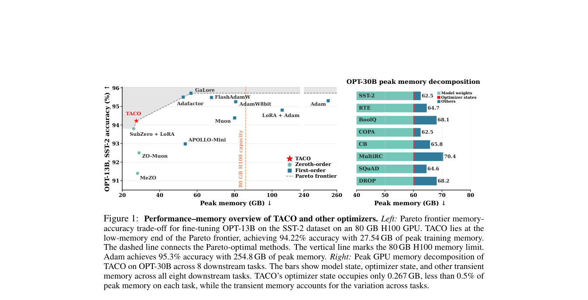

# TACO: Ternary Absolute-max Column-wise One-sparse Optimizer for LLM Fine-Tuning

> **复现级别：L1 核心机制诊断。** 执行一稀疏方向与低精度列 momentum，并在 A100 上验证 CUDA 更新；未复现 13B/32B 全参微调或论文精度。

## 论文信息

| 字段 | 内容 |
|---|---|
| 论文链接 | [arXiv 2610.02199](https://arxiv.org/abs/2610.02199) |
| 公司/机构 | University of Central Florida（按第一作者署名单位） |
| 首次公开日期 | 2026-10-01（arXiv v1） |
| 原文开源代码 | 是：[https://github.com/Jichao2357/TACO_optimizer](https://github.com/Jichao2357/TACO_optimizer) |
| Adapter | `taco-optimizer` |
| 本地复现代码 | [`src/auto_research/foundation_latest_20261002.py`](https://github.com/daiwk/auto-research/blob/main/src/auto_research/foundation_latest_20261002.py) |

## 原始论文总结

### 背景与主要改动

每个二维权重列只保留绝对值最大的梯度分量及符号，形成 column-wise one-sparse steepest direction；低精度列状态替代逐参数 dense optimizer state。

<!-- paper-figure:start -->
### 原论文关键图

> **原论文关键图**：展示论文核心架构、训练流程或系统协议。图片来自[原论文](https://arxiv.org/abs/2610.02199)，版权归原作者所有；点击图片可查看来源。
<!-- paper-figure:end -->

### 核心公式

$D_{ij}=sign(G_{ij})$ 当 $i=argmax_k|G_{kj}|$，否则为 0。

### 论文离线与线上效果

OPT-13B 上 optimizer state 27.7GB→0.16GB（174×），峰值显存 80.6GB→27.5GB（2.9×）。

## 本地复现

> **本地对照口径**：基线为机制关闭或默认状态，实验组为开启对应核心算子。本批指标只验证不变量、梯度或状态转换，不表示论文规模效果。

- 三种子诊断：[`metrics/mechanism-seeds42-44.json`](metrics/mechanism-seeds42-44.json)
- `diagnostic_only=true`，不进入正式能力排名。
- GPU 验证：[`docs/gpu-validations/taco-optimizer-a100-20261002.json`](https://github.com/daiwk/auto-research/blob/main/docs/gpu-validations/taco-optimizer-a100-20261002.json)

## 复现边界

执行一稀疏方向与低精度列 momentum，并在 A100 上验证 CUDA 更新；未复现 13B/32B 全参微调或论文精度。
