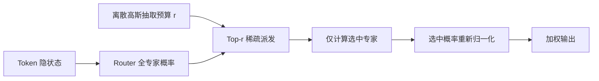
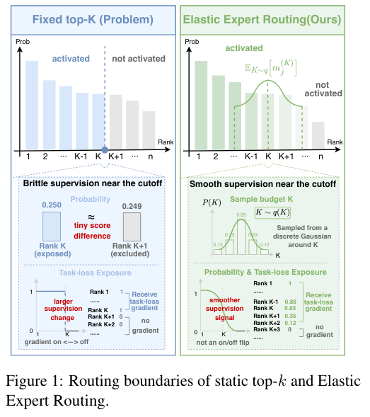

# Elastic Expert Routing：平滑稀疏专家的 Top-k 边界

## 论文信息

| 字段 | 内容 |
|---|---|
| 论文链接 | [Smoothing the Top-k Exposure Boundary for Sparse Mixture-of-Experts](https://arxiv.org/abs/2610.11575) |
| 一作机构/公司/学校 | Yunkai Chai；上海人工智能实验室 / 上海交通大学 |
| 首次公开日期 | 2026-10-08（arXiv v1） |
| 原作者代码 | 未找到作者公开实现；不把第三方实现写成官方代码 |
| Adapter | `elastic-expert-routing` |
| 本地代码 | `src/auto_research/foundation_models/elastic_expert_routing.py` |
| 可运行入口 | `scripts/run_elastic_expert_lm.py` |

## 原始论文总结

### 背景与主要改动

固定 Top-k 会让排序边界外的专家长期缺少训练曝光。该方法训练时为每个 token、每层独立抽取邻近的专家预算，在不改变期望预算的情况下，让边界附近专家参与真实稀疏计算。部署时恢复固定 k。



<!-- paper-figure:start -->
### 原论文关键图

[](https://arxiv.org/pdf/2610.11575#page=1)

> **原论文 Figure 1（关键图）**：展示原论文方法的总体设计和关键组成。图片来自[原论文](https://arxiv.org/abs/2610.11575)，版权归原作者所有；点击图片可查看来源。
<!-- paper-figure:end -->

### 核心公式

训练预算概率为 $P(r)\propto\exp(-(r-k)^2/(2\sigma^2))$，支持集必须关于 k 对称且不越界，因而 $\mathbb E[r]=k$。推理预算固定为 k。负载均衡统计使用实际被派发的 token，而不是假定每个 token 都选相同数量专家。

### 论文离线与线上效果

原文在预训练和微调的 MoE 上研究边界曝光；未报告工业线上 A/B。原文实验规模、tokenizer、预算与本地字符模型不同，不直接比较困惑度。

## 本地复现

实现真实因果自回归 Transformer + 稀疏 MoE，包含 router、专家梯度、辅助均衡损失和固定 k 推理。不是把所有专家都计算一遍后乘零。相同参数形状、初始化、训练位置和预算对照 `radius=0` 与 `radius=1`。

```bash
PYTHONPATH=src python scripts/run_elastic_expert_lm.py \
  --text-file data/shakespeare.txt \
  --dataset-id karpathy/char-rnn/tinyshakespeare \
  --dataset-revision sha256:86c4e6aa9db7c042ec79f339dcb96d42b0075e16b8fc2e86bf0ca57e2dc565ed \
  --steps 100 --seed 42 --device cuda --output runs/elastic-42.json
```

### 数据协议与结果

公开 Tiny Shakespeare，按原文本顺序 90%/5%/5% 划分 train/validation/test。词表共享，不共享预测目标；参数不使用 test 选择。字符 PPL 不是原文 token PPL。

| Seed | 固定 k：validation 字符 PPL | Elastic：validation 字符 PPL | Elastic 实际训练平均专家数 |
|---|---:|---:|---:|
| 42 | 24.4923 | 24.5578 | 2.99755 |
| 43 | 24.0827 | 24.1720 | 3.00089 |
| 44 | 25.1088 | 25.1332 | 3.00318 |

A30 上完成每组 100 步训练。该小预算结果没有改善，保留负结果。三种子只支持本次缩小模型对照，不证明原论文结论；本地结果标为诊断。推理每个 token 的专家数均为 3。

### 代码映射与边界

- `ElasticExpertRouting`：离散高斯、可变预算、实际派发、负载均衡。
- `ElasticMoELanguageModel`：真实因果语言模型训练/推理。
- `tests/test_elastic_expert_routing.py`：期望预算、边界拒绝、梯度与派发数。

未复刻 Qwen 大型 MoE 权重、FineWeb-Edu 预训练规模或多机 dispatch 系统；不宣称墙钟等成本。Evolve 尚未执行接入，不能仅靠目录条目算集成。
