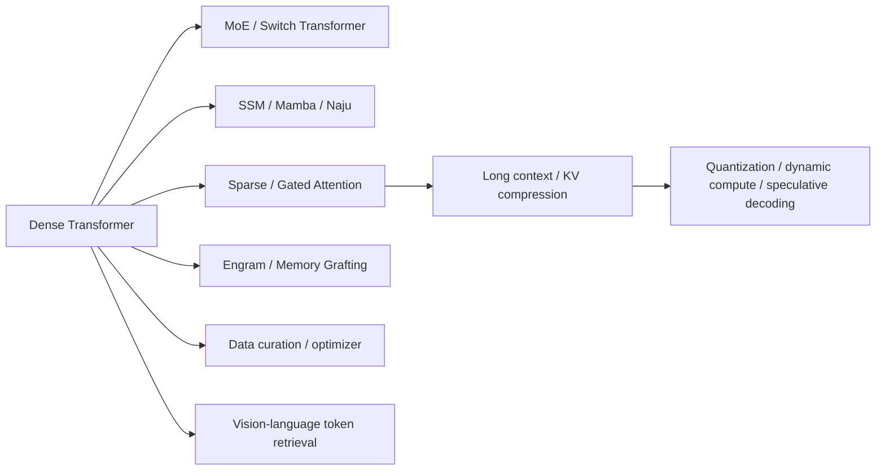

# 基础模型论文谱系与缺口

## 已覆盖主干

当前已覆盖 MoE、状态空间模型、稀疏和门控注意力、条件记忆、长上下文位置编码、
预训练数据编排、优化器、量化、动态宽度、推测解码与视觉 token 检索。能够在本地
真实训练的算子已逐步接入 LLM evolve；只有 kernel 或大规模集群才能体现的方法会
保持明确的系统复现边界。

## 仍需补齐

| 优先级 | 缺口 | 接入前提 |
|---|---|---|
| P0 | 预训练数据 mixture 与 curriculum 的多轮 evolve | 固定 token 预算、隔离 validation/test、数据污染检查 |
| P0 | 多模态理解与统一理解/生成 | 可下载图文数据、真实视觉 encoder/tokenizer 和公共 benchmark |
| P1 | test-time compute、verifier 与动态 reasoning budget | 同时报告正确率、token、延迟和调用成本 |
| P1 | 独立 RoPE/ALiBi 长上下文公平对照 | 相同参数、训练长度和外推长度 |
Chinchilla 一类 scaling law 需要多个 compute/data 预算点，也
不能用单次小模型训练替代完整曲线。
