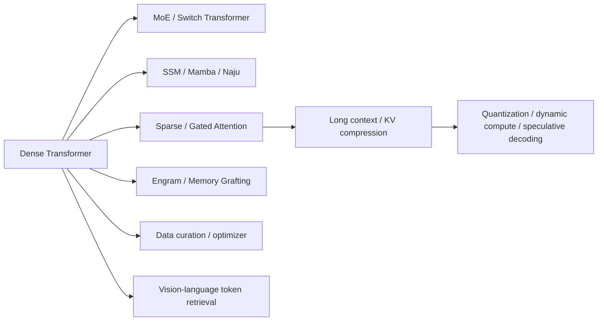

# 基础模型论文谱系与缺口

## 已覆盖主干

当前已覆盖 MoE、状态空间模型、稀疏和门控注意力、条件记忆、长上下文位置编码、
预训练数据编排、优化器、量化、动态宽度、推测解码与视觉 token 检索。能够在本地
真实训练的算子已逐步接入 LLM evolve；只有 kernel 或大规模集群才能体现的方法会
保持明确的系统复现边界。

## 静态能力收口

| 能力 | 状态 | 完成证据 |
|---|---|---|
| test-time compute、verifier 与动态 reasoning budget | 已完成 | [PR #113](https://github.com/daiwk/auto-research/pull/113)：固定 SmolLM2 revision，并报告正确率、token、延迟和调用成本 |
| scaling-law 多预算曲线 | 已完成 | [PR #114](https://github.com/daiwk/auto-research/pull/114)：模型规模、数据量和训练预算网格及拟合残差 |
| 视频与音频多模态 | 已完成 | [PR #115](https://github.com/daiwk/auto-research/pull/115)：Video-MME-v2 与 ESC-50/CLAP 公开评测路径 |
| 具身与多模态后训练 | 已完成 | [PR #116](https://github.com/daiwk/auto-research/pull/116)：SmolVLA/LeRobot 训练入口和硬件/simulator 边界 |

预训练 data mixture/curriculum、多模态图文理解、RoPE/ALiBi 已完成独立实现并进入
evolve，不再列为待办。当前没有尚未实现的静态 P0/P1；后续只把新发现且具备真实算子、
公开数据和公平评测的论文加入动态队列。大型集群、专有 kernel 或真实机器人能力仍须明确
标注复现边界，不能用小模型 smoke 冒充生产结论。
