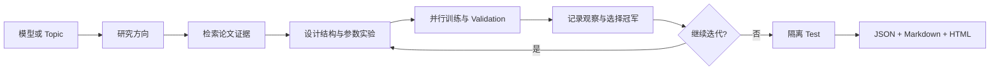

---
hide:
  - toc
---

LOCAL-FIRST · REPRODUCIBLE · ITERATIVE

# Auto Research

从工业论文复现，到给定模型与研究方向后的自动检索、并行实验和多轮进化。所有结论都保留论文证据、公开数据协议、实验轨迹与可复现配置。

  <a class="md-button md-button--primary" href="auto-research/">开始自动研究</a>
  <a class="md-button" href="reproductions/">浏览论文复现</a>

## 两大核心能力

### Auto Research

输入 topic，或输入已有模型、公开数据集和自然语言调研方向。系统检索相关论文，形成可审计的结构假设，并行运行公平实验，再依据 validation 结果继续下一轮迭代。

- topic → 论文 → 实验 → 报告
- RankMixer / HyFormer 定向进化
- LONGER、UniMixer 等结构组合
- JSON、Markdown 与 HTML 研究看板

[了解自动研究流程 →](auto-research.md)

### 论文复现

面向互联网公司的推荐、搜索、广告与 LLM 论文。每篇实现独立保存模型、实验、指标和中文解读，明确区分论文线上 A/B、论文离线结果与本地公开数据实验。

- 工业论文优先，线上 A/B 为核心筛选条件
- 公开原始数据和公平基线
- 背景、架构图、公式与复现边界
- 按公司、主题和发布时间浏览

[进入论文复现库 →](reproductions/README.md)

## 自动研究闭环

## 从这里开始

1. **安装项目**：从[项目 README](project-readme.md)创建 Python 环境并安装 `auto-research` 命令。

2. **选择研究方式**：查看[自动研究总览](auto-research.md)，选择通用 topic loop 或模型定向进化。

3. **阅读已有结论**：从[复现总览](reproductions/README.md)进入，或按[公司](reproductions/catalog/by-company.md)、[主题](reproductions/catalog/by-topic.md)、[年月](reproductions/catalog/by-month.md)浏览。

!!! note "数字口径"
    本站始终区分原论文离线指标、原论文线上 A/B 和本地公开数据实验。论文宣称的线上提升不会被写成本地提升；负结果、失败实验和明显偏置也会保留。
