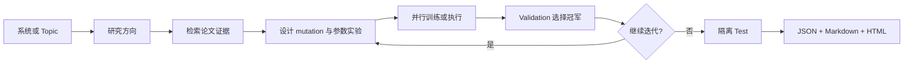

---
hide:
  - toc
---

LOCAL-FIRST · REPRODUCIBLE · ITERATIVE

# Auto Research

平台用两种工作流服务不同研究领域：先复现论文、建立可信组件与评测，再把组件接入
自动研究引擎做并行实验和多轮进化。领域不被写死，可以是搜广推、纯 LLM、Agent，
也可以通过统一接口继续扩展。

  <a class="md-button md-button--primary" href="auto-research/">开始自动研究</a>
  <a class="md-button" href="research-library/">浏览论文实现</a>

## 两大核心工作流

### 自动研究与进化

输入任意研究 topic，或提供已有系统、公开数据集和自然语言方向。系统检索论文证据，
生成可审计假设，并行执行公平实验，再根据 validation 结果继续迭代。研究对象通过
adapter 接入，不限定为推荐模型。

- topic → 论文 → 假设 → 实验 → 下一轮
- 已支持 RankMixer、HyFormer 与本地 micro‑LLM
- 可搜索结构、数据配方、后训练方法和超参数
- Agent 已有评测底座，专用进化 adapter 待接入

[了解自动研究流程 →](auto-research.md)

### 论文实现与评测

论文库不再等同于“搜广推目录”，而是统一承载三个领域。每篇实现独立保存代码、
实验、指标和中文解读，并明确区分原论文效果、本地结果与机制复现。

- 搜广推及 LLM 应用：互联网大厂、线上 A/B 硬门槛
- 纯 LLM：架构、预训练与后训练，使用公共 benchmark
- Agent：记忆、规划、工具使用与自我进化
- 统一论文信息、架构图、公式、代码和复现边界

[进入论文实现与评测库 →](research-library.md)

## 工作流 × 研究领域

| 研究领域 | 论文实现与评测 | 自动研究与进化 |
|---|---|---|
| **搜广推与 LLM 应用** | 论文库可用 [工业论文库](reproductions/README.md)：推荐、搜索、广告、生成式推荐和 LLM 应用；线上 A/B 是硬门槛 | 进化可运行 RankMixer / HyFormer 已支持结构、参数和训练配置的多轮进化 |
| **纯 LLM** | 论文库可用 [LLM 后训练库](post-training/README.md)及纯 LLM 架构、预训练论文；以公共 benchmark 为准 | 进化可运行 micro‑LLM 已支持架构、数据配方与后训练方案进化 |
| **Agent** | 论文库可用 [Agent 论文库](agent-research/README.md)：记忆、规划、工具使用和自我进化方法 | 正在接入 统一 benchmark 与 trace 已就绪；专用多代 mutation adapter 待接入 |
| **其他主题** | 可扩展 按统一论文页合同增加领域目录 | 可扩展 按统一 research adapter 接入模型、数据、mutation 与 evaluator |

[查看领域如何接入自动进化 →](evolution-domains.md)

## 自动研究闭环

```mermaid
flowchart LR
  A[系统或 Topic] --> B[研究方向]
  B --> C[检索论文证据]
  C --> D[设计 mutation 与参数实验]
  D --> E[并行训练或执行]
  E --> F[Validation 选择冠军]
  F --> G{继续迭代?}
  G -- 是 --> D
  G -- 否 --> H[隔离 Test]
  H --> I[JSON + Markdown + HTML]
```

## 从这里开始

1. **安装项目**：从[项目 README](project-readme.md)创建 Python 环境并安装 `auto-research` 命令。

2. **选择工作流**：先从[论文实现与评测库](research-library.md)建立可信组件，或直接进入[自动研究总览](auto-research.md)进行 topic research 和模型进化。

3. **选择领域**：搜广推与 LLM 应用进入[工业论文库](reproductions/README.md)，纯 LLM 后训练进入[后训练库](post-training/README.md)，Agent 进入[Agent 论文库](agent-research/README.md)。

!!! note "数字口径"
    本站始终区分原论文离线指标、原论文线上 A/B 和本地公开数据实验。论文宣称的线上
    提升不会被写成本地提升；负结果、失败实验和明显偏置也会保留。
