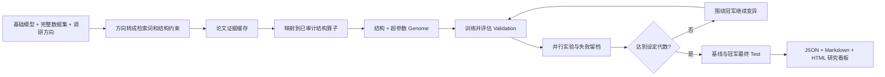

# 模型自动进化

该功能面向“已有一个可训练模型，希望围绕一段自然语言调研方向持续做实验”的场景。输入基础模型、公开数据集和调研方向后，系统自动检索论文、形成结构假设、并行训练、根据 validation 观察决定下一轮方向，最后隔离 test，并生成可读研究档案。

## 流程



结构与普通参数在同一个 genome 中共同搜索：

```text
architecture, dimensions, layers, learning_rate, optimizer,
batch_size, experts, interval_residual, auxiliary_weight
```

每个 trial 保存 `generation`、`parent_id`、论文来源、变异理由、validation 指标、训练 loss、参数量和耗时，因此可以完整回溯模型如何演化。

## RankMixer 首批论文算子

| 论文 | 内置结构 | 实际加入当前网络的机制 |
|---|---|---|
| [RankMixer](https://arxiv.org/abs/2507.15551) | `rankmixer_smoe` | parameter-free token mixing、per-token FFN、ReLU routed MoE |
| [TokenMixer-Large](https://arxiv.org/abs/2602.06563) | `tokenmixer_large` | mixing-reverting、per-token SwiGLU、interval residual、middle auxiliary head |
| [Zenith](https://arxiv.org/abs/2601.21285) | `zenith` | Prime Token RSA Fusion 与 tokenwise SwiGLU Token Boost |
| [MOI-Mixer](https://arxiv.org/abs/2108.07505) | `moi_mixer` | 一阶线性项与二阶显式交互 channel mixing |

在线 arXiv 检索仍会返回其他相关论文。只有已映射并经过 shape/训练测试的结构才能进入 population；其余论文保留为 `evidence-only`，避免从论文文本直接执行不可审计代码。

## 安装命令

`auto-research` 是本项目安装后生成的命令，不是另一个需要单独下载的软件。第一次使用时，在仓库根目录执行：

```bash
cd /path/to/auto-research
python3 -m venv .venv
source .venv/bin/activate
python -m pip install -U pip
python -m pip install -e '.[neural-recs]'
```

确认安装成功：

```bash
auto-research --help
auto-research evolve --help
```

`-e` 是可编辑安装，修改或更新项目源码后通常无需重新安装。新开一个终端后，需要重新激活虚拟环境：

```bash
cd /path/to/auto-research
source .venv/bin/activate
```

如果不想激活环境，可直接使用完整路径：

```bash
.venv/bin/auto-research evolve --help
```

只有 `pyproject.toml` 中的依赖发生变化时，才需要重新执行安装命令。

## 方向驱动的使用方式

```bash
auto-research evolve \
  --model rankmixer \
  --dataset movielens-1m \
  --direction "把 LONGER、UniMixer 及相关高效 Transformer 结构加入 RankMixer，比较长序列压缩、可学习 token mixing 及其组合" \
  --generations 3 \
  --population 6 \
  --workers 3 \
  --steps 300 \
  --papers 8 \
  --seeds 42,43,44
```

基础模型也可以换成 HyFormer：

```bash
auto-research evolve \
  --model hyformer \
  --dataset movielens-1m \
  --direction "引入 LONGER 的长序列压缩和 UniMixer 的参数化 mixing，升级高效 Transformer" \
  --generations 3 --population 6 --workers 3 --steps 300
```

每一代的候选会并行执行。macOS 上多 worker 使用独立进程，避免多个实验共享随机数状态或模型；每个实验仍保持相同 split、seed 和训练预算。完整过程写入：

- `result.json`：机器可读的论文、配置、父子关系、指标、失败原因和每轮决策。
- `report.md`：适合代码审查和长期归档的中文研究报告。
- `index.html`：无需服务即可打开的响应式研究看板，展示效果、假设、观察和下一轮决策。

第一轮是公平结构消融：所有候选继承基础模型的相同超参数，只改变结构。第二轮起才围绕上一轮冠军分别调整层数、维度、学习率、优化器和 batch size，避免把结构收益和调参收益混在一起。

## 数据规模

默认不再裁剪训练数据：MovieLens-100K 使用完整的 932 个有效用户和 1,682 个物品；MovieLens-1M 使用完整 leave-two-out 序列。为控制每个候选的全库排序成本，默认用固定且均匀覆盖的 1,000 用户 cohort 做 validation/test；传入 `--evaluation-users 0` 可评估全部用户。只有为了快速验证流程时，才显式传入 `--maximum-users` 和 `--maximum-items`。数据规模与评估 cohort 都会记录到报告中，避免把 smoke test 误写成正式实验。

| 方向 | RankMixer 候选 | HyFormer 候选 | 实际机制 |
|---|---|---|---|
| LONGER | `rankmixer_longer` | `hyformer_longer` | 分块 token merge、global interest、recent token 保留 |
| UniMixer | `rankmixer_unimixer` | `hyformer_unimixer` | 可学习 token mixing 与逐 token channel mixing |
| 组合 | `rankmixer_longer_unimixer` | `hyformer_longer_unimixer` | 同时验证长序列压缩与参数化 mixing 是否互补 |

## 早期小规模诊断记录

MovieLens-100K compact 使用 220 个用户、360 个物品，训练 40 steps；运行两代、每代三个子代、seed 42。

| 模型 | Validation NDCG@10 | Test Hit@10 | Test NDCG@10 |
|---|---:|---:|---:|
| 初始 RankMixer dense | 0.00956 | 0.05000 | 0.02402 |
| 进化冠军：MOI-Mixer，1 层，batch 24 | **0.01335** | **0.07727** | **0.03864** |

冠军相对初始模型 validation NDCG `+39.65%`，最终隔离 test NDCG `+60.87%`。与此同时 head share 从 `0.08864` 上升到 `0.14727`，说明效果提升伴随更强的头部集中，不能只看单一主指标。

稳定指标见 [`evolution/rankmixer-movielens-2g3p-seed42.json`](evolution/rankmixer-movielens-2g3p-seed42.json)。该结果是一次小预算功能验证，不等同于论文复现或多 seed 稳定结论。

## 评估纪律

- 初始模型和全部子代共享数据切分、候选全集、训练 steps 和 seed。
- 结构与参数晋级只能读取 validation；test 不参与任何一轮选择。
- 全部代际结束后，初始基线与冠军从头训练并各评估一次 test。
- 负结果和失败 trial 保留；不会为了“进化成功”删除落后结构。
- checkpoint、数据和原始 runs 不提交 Git，只保留复现命令和稳定标量。

## 后续扩展

增加新目标模型时，实现一个 evaluator：把 `Genome` 转成该模型配置，训练后返回统一 validation/test 指标。增加新论文结构时，在目标模型中实现独立 architecture operator，并补充论文 ID、方法摘要、shape 测试和最小训练测试。自然语言负责约束研究空间，不能直接生成并执行未经审计的任意代码。
