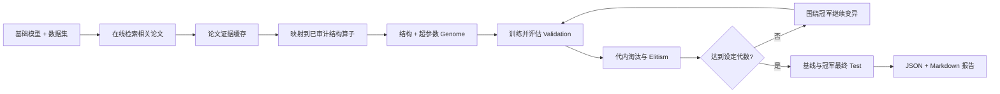

# 模型自动进化

该功能面向“已有一个可训练模型，希望持续吸收新论文结构并自动调优”的场景。输入目标模型和公开数据集后，系统自动执行论文检索、结构映射、参数变异、多轮训练、validation 淘汰和最终 test。

## 流程



结构与普通参数在同一个 genome 中共同搜索：

```text
architecture, dimensions, layers, learning_rate, optimizer,
batch_size, experts, interval_residual, auxiliary_weight
```

每个 trial 保存 `generation`、`parent_id`、论文来源、变异理由、validation 指标、训练 loss、参数量和耗时，因此可以完整回溯模型如何演化。

## RankMixer 首批论文算子

| 论文 | 内置结构 | 实际加入当前网络的机制 |
|---|---|---|
| [RankMixer](https://arxiv.org/abs/2507.15551) | `rankmixer_smoe` | parameter-free token mixing、per-token FFN、ReLU routed MoE |
| [TokenMixer-Large](https://arxiv.org/abs/2602.06563) | `tokenmixer_large` | mixing-reverting、per-token SwiGLU、interval residual、middle auxiliary head |
| [Zenith](https://arxiv.org/abs/2601.21285) | `zenith` | Prime Token RSA Fusion 与 tokenwise SwiGLU Token Boost |
| [MOI-Mixer](https://arxiv.org/abs/2108.07505) | `moi_mixer` | 一阶线性项与二阶显式交互 channel mixing |

在线 arXiv 检索仍会返回其他相关论文。只有已映射并经过 shape/训练测试的结构才能进入 population；其余论文保留为 `evidence-only`，避免从论文文本直接执行不可审计代码。

## 使用方式

```bash
auto-research evolve \
  --model rankmixer \
  --dataset movielens-100k \
  --generations 3 \
  --population 4 \
  --steps 100 \
  --papers 8 \
  --seeds 42,43,44
```

无网络环境可以使用已缓存并审核的论文映射：

```bash
auto-research evolve \
  --model rankmixer \
  --dataset movielens-100k \
  --generations 2 \
  --population 3 \
  --steps 40 \
  --offline
```

## 首次端到端实验

MovieLens-100K compact 使用 220 个用户、360 个物品，训练 40 steps；运行两代、每代三个子代、seed 42。

| 模型 | Validation NDCG@10 | Test Hit@10 | Test NDCG@10 |
|---|---:|---:|---:|
| 初始 RankMixer dense | 0.00956 | 0.05000 | 0.02402 |
| 进化冠军：MOI-Mixer，1 层，batch 24 | **0.01335** | **0.07727** | **0.03864** |

冠军相对初始模型 validation NDCG `+39.65%`，最终隔离 test NDCG `+60.87%`。与此同时 head share 从 `0.08864` 上升到 `0.14727`，说明效果提升伴随更强的头部集中，不能只看单一主指标。

稳定指标见 [`evolution/rankmixer-movielens-2g3p-seed42.json`](evolution/rankmixer-movielens-2g3p-seed42.json)。该结果是一次小预算功能验证，不等同于论文复现或多 seed 稳定结论。

## 评估纪律

- 初始模型和全部子代共享数据切分、候选全集、训练 steps 和 seed。
- 结构与参数晋级只能读取 validation；test 不参与任何一轮选择。
- 全部代际结束后，初始基线与冠军从头训练并各评估一次 test。
- 负结果和失败 trial 保留；不会为了“进化成功”删除落后结构。
- checkpoint、数据和原始 runs 不提交 Git，只保留复现命令和稳定标量。

## 后续扩展

增加新目标模型时，实现一个 evaluator：把 `Genome` 转成该模型配置，训练后返回统一 validation/test 指标。增加新论文结构时，在目标模型中实现独立 architecture operator，并补充论文 ID、方法摘要、shape 测试和最小训练测试。代际控制、论文清单、报告和 CLI 无需修改。
