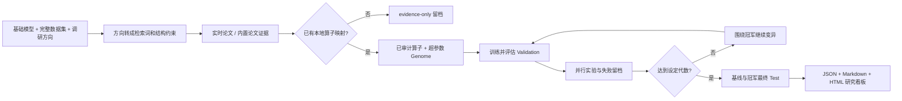

# 模型自动进化

该功能面向“已有一个可训练系统，希望围绕一段自然语言方向持续做实验”的场景。
当前可进化推荐模型、micro‑LLM、后训练 recipe 和 Agent policy。
当前还支持固定真实 checkpoint 的 test-time compute 进化。

后训练 genome 中，算法、数据 recipe、teacher、rollout、学习率、group size 和 steps
会真实改变当前 numpy candidate-policy evaluator；`gradient_accumulation` 与
`mixed_precision` 是面向真实 checkpoint runner 的 promotion contract，在该轻量 evaluator
里只被组合、记录和导出，不会被伪装成已产生数值作用。候选晋级到 checkpoint runner 后，
这两个系统轴才参与实际训练与显存/吞吐比较。

!!! summary "候选有明确来源，未经审核的代码不会直接执行"
    **真正参加训练的结构和算法，都已经在本仓库实现并通过测试。**运行时可以联网
    搜索最新论文，但新搜到且尚未实现的论文只作为 `evidence-only` 证据保存，不会
    自动变成可执行代码。系统所谓“进化”，主要是在已注册 provider 和已审核算子之间
    做公平消融、组合和超参数变异，并根据 validation 结果继续下一轮。生成的新插件
    必须经过隔离测试和人工批准，才能晋级为可执行算子。

## 候选到底从哪里来 {#candidate-sources}

一次 evolve 会同时出现四类内容，它们的含义不同：

| 页面或报告中的内容 | 来源 | 会不会训练 | 是否属于系统自己创新 |
|---|---|---:|---|
| `installed-paper` | 论文已经被本项目实现，并登记论文 ID → 本地算子映射 | 会 | 否，是论文机制的本地实现 |
| `retrieved-paper` | 按 `--direction` 实时检索；离线时使用内置证据 | 不会 | 否，只是研究证据和后续实现候选 |
| `generated-combination` | 控制器组合已实现结构、数据 recipe、后训练/Agent 组件或参数 | 会 | 是新的工程实验假设 |
| `novel-proposal` | 从论文规格或失败轨迹形成、尚未通过插件晋级流程的假设 | 不会 | 可能是新假设，但不能在审核前执行 |

可执行能力通过 `EvolutionProvider` 注册。一个 provider 声明可用数据集、论文检索领域、
初始 genome 和 evaluator，因此新增模型不再修改统一代际控制器或 CLI 大分支。

所以，自然语言 `--direction` 有两个作用：

1. 生成论文检索词，记录与方向相关的新证据；
2. 从已实现算子中提高相关候选的优先级、约束组合空间。

它不会把论文 PDF 翻译成 Python，也不会让模型自由生成代码后直接训练。若实时发现的
论文值得采用，需要先完成“本地实现 → 单元/最小训练测试 → 论文 ID 映射”，下次
evolve 才能执行它。

## 一个具体例子

假设输入：

```text
基础模型：RankMixer
方向：把 LONGER、UniMixer 及相关高效 Transformer 结构加入 RankMixer
```

系统实际做的是：

1. 在线搜索与 LONGER、UniMixer、efficient Transformer 相关的论文；离线模式则读取
   内置清单。
2. 识别到 LONGER 和 UniMixer 已有本地实现，因此开放
   `rankmixer_longer`、`rankmixer_unimixer` 和经过编码测试的组合
   `rankmixer_longer_unimixer`。
3. 对仅在网上找到、但没有本地算子映射的论文标记 `evidence-only`。
4. 第一轮保持训练预算和超参数一致，只比较结构；后续轮围绕 validation 冠军搜索
   层数、维度、学习率、优化器和 batch size。
5. 全部轮次结束后，才在隔离 test 上比较初始基线与最终冠军。

这意味着组合结构是仓库中明确实现的工程假设，不是把两个论文名字拼在配置里。

## 最短操作路径

```bash
# 1. 在仓库根目录安装命令
python3 -m venv .venv
source .venv/bin/activate
python -m pip install -e '.[neural-recs]'

# 2. 先跑帮助，确认可用参数
auto-research evolve --help

# 3. 跑一个可在本地完成的推荐实验
auto-research evolve \
  --model rankmixer \
  --dataset movielens-100k \
  --direction "比较 LONGER、UniMixer 及其组合" \
  --generations 3 --population 4 --workers 2 \
  --steps 100 --papers 8 --seeds 42
```

运行完成后先打开：

```text
runs/evolution/rankmixer-<timestamp>/index.html
```

其中“论文证据”会明确显示本地算子或 `evidence-only`；实验表中的“来源”会区分
论文算子、白名单组合/调参和初始基线。`report.md` 适合代码审查，`result.json`
保存完整配置与父子关系。

若希望确认没有运行时联网检索，可加 `--offline`。这不会禁用已实现算子，只会停止
在线论文搜索和数据下载；所需数据必须已经在本地缓存。

## 完整流程

### 中断恢复、GPU 资源与稳健晋级

每个 trial 完成后都会原子更新 `result.json`。中断后可从原运行目录继续：

```bash
auto-research evolve \
  --model rankmixer --dataset movielens-1m \
  --direction "继续上一轮高效结构研究" \
  --generations 5 --resume runs/evolution/rankmixer-20260809-120000
```

`--retries` 控制失败 trial 的重试次数；CUDA 下 `--gpu-slots` 表示真正可并发的独立
GPU 槽位数；`--gpu-memory-per-trial-mb` 还会根据启动时的可用显存收紧并发数。
生产 evaluator 的每个 trial 都在独立进程运行，`--trial-timeout-seconds` 到期会真正
终止进程，而不只是把仍在后台运行的任务标记失败。冠军按照
`fitness - z × standard_error` 排序；当 evaluator 提供 `fitness_std` 时，
`--confidence-z` 会惩罚高方差候选。正式结论建议使用：

```text
--seeds 42,43,44 --promotion-min-seeds 3 --confidence-z 1.0
```

单 seed 仍可用于 smoke，但不满足稳定提升声明条件。

### 真实 checkpoint 的推理预算进化

`reasoning-checkpoint` 固定使用公开 causal LM revision，只搜索推理侧 genome：采样数、最大
生成 token 与共识早停阈值。它不会读取 gold answer 选择候选；答案由 self-consistency
多数表决决定，gold 只在决定后计算准确率。每个 trial 同时记录 accuracy、生成 token、
延迟、模型调用数和估算调用成本，selection 对 token 消耗施加小惩罚。

```bash
auto-research evolve \
  --model reasoning-checkpoint \
  --dataset gsm8k-generate \
  --direction "搜索 1/2/4/8 次采样、verifier 和动态停止预算" \
  --generations 2 --population 4 \
  --maximum-examples 64 --seeds 42,43,44 \
  --device cuda
```

默认 checkpoint 是 `HuggingFaceTB/SmolLM2-135M-Instruct`，revision 固定为 40 位 commit。
离线开发机可用 `--reasoning-checkpoint-path` 指向已经下载的 snapshot。预算变化发生在
validation；冠军选定后才进入隔离 test。

### 新论文算子的安全晋级

实时检索论文首先只是 `retrieved-paper`。若外部研究代理生成候选实现，需要提供一个
包含来源论文、provider、文件白名单和验证命令的 JSON spec，然后经过三步：

```bash
auto-research candidate stage --spec candidate.json
auto-research candidate verify --id paper-op --timeout 300
auto-research candidate promote --id paper-op \
  --destination src/auto_research/evolution/plugins/paper_op --approve
```

候选先写入 `.auto-research/candidates/`，路径、文件类型和单文件大小均受限制；验证结果
单独留档。最后一步必须显式传入 `--approve`，且只能写入仓库内尚不存在的目录。
这提供了“论文 → 结构化候选 → 隔离验证 → 人工批准 → 正式注册”的基础链路，
但不会把未审代码自动放进训练主进程。

也可以让一次 evolve 自动调用外部候选生成器：

```bash
auto-research evolve ... \
  --candidate-generator-command "python tools/design_candidate.py" \
  --candidate-timeout-seconds 300
```

控制器会先写出 `paper-candidates.json`（包含论文来源、实现状态、接口约束和禁止声明），
再把该路径作为生成器最后一个参数。生成器输出 `CandidatePluginSpec` JSON；自动路径
拒绝生成器自带的执行命令，只做语法检查，且产物不会自动 promote 或参加当前轮训练。这个边界保证“网上新论文”
和“已经可执行的论文算子”在报告中不会混淆。


```mermaid
flowchart LR
  A[基础模型 + 完整数据集 + 调研方向] --> B[方向转成检索词和结构约束]
  B --> C[实时论文 / 内置论文证据]
  C --> D{已有本地算子映射?}
  D -- 否 --> X[evidence-only 留档]
  D -- 是 --> E[已审计算子 + 超参数 Genome]
  E --> F[训练并评估 Validation]
  F --> G[并行实验与失败留档]
  G --> H{达到设定代数?}
  H -- 否 --> I[围绕冠军继续变异]
  I --> F
  H -- 是 --> J[基线与冠军最终 Test]
  J --> K[JSON + Markdown + HTML 研究看板]
```

结构与普通参数在同一个 genome 中共同搜索：

```text
architecture, dimensions, layers, learning_rate, optimizer,
batch_size, experts, interval_residual, auxiliary_weight
```

每个 trial 保存 `generation`、`parent_id`、论文来源、变异理由、validation 指标、训练 loss、参数量和耗时，因此可以完整回溯模型如何演化。

## 可执行论文算子示例：RankMixer

| 论文 | 内置结构 | 实际加入当前网络的机制 |
|---|---|---|
| [RankMixer](https://arxiv.org/abs/2507.15551) | `rankmixer_smoe` | parameter-free token mixing、per-token FFN、ReLU routed MoE |
| [TokenMixer-Large](https://arxiv.org/abs/2602.06563) | `tokenmixer_large` | mixing-reverting、per-token SwiGLU、interval residual、middle auxiliary head |
| [Zenith](https://arxiv.org/abs/2601.21285) | `zenith` | Prime Token RSA Fusion 与 tokenwise SwiGLU Token Boost |
| [MOI-Mixer](https://arxiv.org/abs/2108.07505) | `moi_mixer` | 一阶线性项与二阶显式交互 channel mixing |
| [WHALE](https://arxiv.org/abs/2607.17017) | `rankmixer_whale` | Wukong 乘性交互、causal attention 与门控 HSTU 更新 |
| [TMallGS](https://arxiv.org/abs/2607.13398) | `rankmixer_tmallgs` | field-wise QKV、噪声门控、token-specific SwiGLU 与 progressive auxiliary loss |
| [Long-History User Transformers](https://arxiv.org/abs/2607.14331) | `rankmixer_long_history` | 异步全历史 encoder 的缓存状态与轻量近期序列融合 |
| [RAMP](https://arxiv.org/abs/2607.17473) | `rankmixer_ramp` | 个性化/公共双路径、feature availability mask、受限路径监督与 prediction alignment |
| [TokenMinds](https://arxiv.org/abs/2606.25147) | `rankmixer_tokenminds` | 从历史物品分层 SID 聚合用户 token，并通过可学习安全门控注入 RankMixer 用户表示 |
| [HA-MoE](https://arxiv.org/abs/2607.27577) | `rankmixer_ha_moe` | 依据样本异构性动态路由专长 expert |
| [Dual-purpose SID](https://arxiv.org/abs/2607.24865) | `rankmixer_dual_sid` | 分层 SID 同时提供协同身份与内容语义 token |
| [MFLI](https://arxiv.org/abs/2602.16124) | `rankmixer_mfli` | 以多切面可学习 code 表示检索空间 |
| [Kunlun](https://arxiv.org/abs/2602.10016) | `rankmixer_kunlun` | GDPA 门控、交互 block 与 CompSkip |
| [ULTRA-HSTU](https://arxiv.org/abs/2602.16986) | `rankmixer_ultra_hstu` | semi-local attention、landmark summary 与 Mixture of Transducers |

AgenticRecTune 不伪装成单一网络结构；其 Actor–Critic–SkillHub 闭环对应本项目统一多轮控制器，独立 adapter `agentic-rec-tune` 会输出完整 generation trace，可作为 evolve 控制策略的回归样例。

这张表中的结构都已经存在于仓库源码中。在线 arXiv 检索仍会返回其他相关论文，但
只有已映射并经过 shape/训练测试的结构才能进入 population；其余论文保留为
`evidence-only`。

Gzip-guided Sparse Attention 已有独立的 byte-level 可执行 adapter，但当前
`micro-llm` evolve 使用 BPE token。为避免把 token ID 截断成 bytes 后伪称论文实现，
它目前以 `evidence-only` 进入调研记录；后续增加 byte-level evolve backend 后再映射为
可变异结构。

## 安装命令

`auto-research` 是本项目安装后生成的命令，不是另一个需要单独下载的软件。第一次使用时，在仓库根目录执行：

```bash
cd /path/to/auto-research
python3 -m venv .venv
source .venv/bin/activate
python -m pip install -U pip
python -m pip install -e '.[neural-recs]'
```

确认安装成功：

```bash
auto-research --help
auto-research evolve --help
```

`-e` 是可编辑安装，修改或更新项目源码后通常无需重新安装。新开一个终端后，需要重新激活虚拟环境：

```bash
cd /path/to/auto-research
source .venv/bin/activate
```

如果不想激活环境，可直接使用完整路径：

```bash
.venv/bin/auto-research evolve --help
```

只有 `pyproject.toml` 中的依赖发生变化时，才需要重新执行安装命令。

## 方向驱动的使用方式

```bash
auto-research evolve \
  --model rankmixer \
  --dataset movielens-1m \
  --direction "把 LONGER、UniMixer 及相关高效 Transformer 结构加入 RankMixer，比较长序列压缩、可学习 token mixing 及其组合" \
  --generations 3 \
  --population 6 \
  --workers 3 \
  --steps 300 \
  --papers 8 \
  --seeds 42,43,44
```

默认启用 `--benchmark-suite public`，但默认仍以总体主指标
`--fitness-metric primary` 晋级，保证升级前后和既有实验口径一致。如果研究目标强调跨切片稳定性，可以显式选择：

```bash
auto-research evolve \
  --model rankmixer \
  --dataset movielens-1m \
  --direction "比较 WHALE、TMallGS、长历史缓存和 RAMP 的稳健性" \
  --benchmark-suite public \
  --fitness-metric public_composite \
  --generations 3 --population 6 --workers 3 --steps 300
```

## 公共评测套件

`evolve` 把评测和训练算子分开。`core` 只执行原有主任务；`public`
在同一个固定 validation cohort 上增加可复核的公共切片，并把所有分项写入
`result.json`、Markdown 和 HTML。所有晋级仍只读取 validation，最终 test 只比较
初始基线与冠军。

### 推荐模型

MovieLens 的 public suite 包含：

| 切片 | 回答的问题 |
|---|---|
| `overall` | 完整固定 cohort 上的 Hit@10、NDCG@10、头部占比和平均流行度 |
| `long_history` | 历史长度位于上四分位的用户，检查长序列结构是否真正受益 |
| `tail_target` | validation/test 目标物品流行度不高于中位数，检查长尾退化 |
| `recent_only` | 仅保留最近 4 个行为，检查对短上下文的鲁棒性 |
| `restricted_features` | RankMixer 公共特征路径，检查个性化特征不可用时的退化 |

`public_composite` 是这些切片 NDCG@10 的等权平均。它不是线上业务指标，也不把
不同论文原始 A/B 数字混成一个分数；其用途是让 evolve 不会只追逐总体
NDCG 而忽略长尾、长历史或受限输入。

需要对齐统一序列建模与特征交互研究时，可启用 [UniRank 兼容套件](unirank.md)：

```bash
auto-research evolve \
  --model rankmixer \
  --dataset movielens-1m \
  --direction "统一序列建模与特征交互" \
  --benchmark-suite unirank \
  --fitness-metric unirank_composite
```

它在上述切片之外增加 chronological pointwise AUC/logloss，并用
`0.5 × NDCG@10 + 0.5 × AUC` 进行 validation 选型。完整大规模结论仍应在
UniRank 官方五数据集实现上复核。

### 语言模型

micro-LLM 的 public suite 保留 WikiText-2 PPL 与 Alpaca instruction loss，并增加：

| 能力切片 | 数据与指标 |
|---|---|
| response preference | Stanford Alpaca held-out 指令；正确回答与确定性截断/乱序负例的 accuracy、pairwise loss |
| reasoning candidate ranking | 官方 GSM8K held-out；gold answer 与 7 个确定性数值干扰项的 candidate Pass@1、NLL |

`public_composite` 选择分数为
`-(LM loss + 0.15 × instruction loss + 0.10 × preference loss + 0.05 × reasoning NLL)`；
`primary` 则保持原来的 `-(LM loss + 0.15 × instruction loss)`。这两个公共切片是
适合小模型本地多轮实验的固定、可重复评测，不等同于完整的开放式生成
AlpacaEval 或 GSM8K exact-match。

两条轨道的最小真实训练 smoke 指标保存在
[`evolution/public-suite-smoke-seed42.json`](evolution/public-suite-smoke-seed42.json)。
它验证四个推荐结构、两个 LLM 后训练方法以及所有公共切片能够完整跑通；该文件
明确记录了极小数据/训练预算，不能当作论文复现结果或模型能力排名。

基础模型也可以换成 HyFormer：

```bash
auto-research evolve \
  --model hyformer \
  --dataset movielens-1m \
  --direction "引入 LONGER 的长序列压缩和 UniMixer 的参数化 mixing，升级高效 Transformer" \
  --generations 3 --population 6 --workers 3 --steps 300
```

## LLM 自动进化

`micro-llm` 是可在 Mac、Linux GPU 和 Linux CPU 训练的 decoder-only Transformer。默认配置约 1200 万至 1600 万参数（具体取决于结构），使用 4K 本地 BPE、384 hidden size、6 layers 和 128 context；这些都可通过 CLI 缩放。它不是为了冒充生产大模型，而是让结构、数据配比和后训练方法能够真实训练、比较和迭代。

```bash
python -m pip install -e '.[llm-evolution]'

auto-research evolve \
  --model micro-llm \
  --dataset wikitext-2 \
  --direction "调研高效 LLM 结构、训练数据配比和 SFT/NEFTune 后训练方法" \
  --generations 3 \
  --population 6 \
  --workers 1 \
  --steps 300 \
  --papers 8 \
  --seeds 42
```

所有 evolve 模型共用 `--device auto|cpu|mps|cuda|cuda:<index>`；Linux CPU 还可传 `--cpu-threads`。安装、CUDA 选择与多卡隔离见[运行环境指南](runtime.md)。

三轮默认分工：

1. **结构轮**：GPT baseline、GQA、LLaMA-style RMSNorm/RoPE/SwiGLU、parallel attention/FFN、Möbius RoPE、Naju、Native Sparse Attention、Gated Attention，以及 AdaDSF 的 dense calibration → Top-K token routing → feature alignment；数据和训练预算保持不变。NSA 与 Gated Attention 还可组合为 `nsa_gated_attention`。Windowed-MTP 属于训练后的 serving 优化，通过独立 reproduction adapter 评测，不用 PPL 伪装成结构收益。
2. **数据轮**：WikiText-only、WikiText + Tiny Shakespeare narrative mixture、从 narrative 向 WikiText 退火的 curriculum；冻结冠军结构。
3. **后训练轮**：普通 SFT、低学习率 SFT、NEFTune，以及
   `dynamic_rubric`（动态 rubric evaluator 与策略协同更新）和
   `off_context_grpo`（特权信息采样、group-relative advantage、importance-ratio
   校正）；使用 Stanford Alpaca/GSM8K 公共训练切片并冻结预训练配方。

当 `--generations` 大于 3 时，后续轮次会继续搜索 hidden size、层数、学习率、优化器（含 Muon）、batch size 和 context length；结构与优化器是独立 genome 轴，因此 NSA/Gated Attention 可继续与 Muon 组合；每个候选仍继承上一轮冠军，形成可追溯的多轮进化链。

2025 P0 的 WikiText-2 同预算对照中，NSA / Gated Attention 的 PPL 分别相对 LLaMA baseline 变化 `-3.17% / -0.72%`；Muon 在未调参的 30-step 默认学习率下为 `+5.61%`（更差）。四轮组合 evolve 的结构轮中 NSA 是三个结构候选里最好，但没有击败当前 GPT baseline；后续 SFT 与 hidden-size 搜索获得最终冠军。完整稳定摘要见 [`evolution/llm-p0-2025-wikitext2-seed42.json`](evolution/llm-p0-2025-wikitext2-seed42.json)，负结果被保留。

选择目标为 `WikiText validation loss + 0.15 × instruction validation loss`。WikiText test 和最终冠军只在三轮结束后评估。默认使用完整 WikiText-2 train；`--maximum-train-tokens` 仅用于 smoke test。

### 本地诊断实验

为了验证整条链路，Mac MPS 上用 0.54M 参数、40 pretraining steps、24 post-training steps、seed 42 跑了三轮，每轮 4 个候选：

| 阶段 | 当轮观察 |
|---|---|
| 结构 | `parallel_gelu` 胜出；matched-budget validation PPL 447.469，略优于 GPT baseline 449.032 |
| 数据 | WikiText-only 胜出；混入 10%/20%/35% narrative 会改善少量 instruction loss，但使 WikiText PPL 变差 |
| 后训练 | 普通 SFT 胜出；优于低学习率 SFT 和本轮 NEFTune alpha 5/10 |

最终隔离 test PPL 从 `416.134` 降到 `405.328`（`-2.60%`），instruction validation loss 从 `6.3804` 降到 `6.2309`。这只是单 seed、极小预算的系统诊断，不能外推到默认 12M+ 模型或标准大模型能力；稳定事实记录见 [`evolution/micro-llm-wikitext2-diagnostic-seed42.json`](evolution/micro-llm-wikitext2-diagnostic-seed42.json)。

每一代的候选会并行执行。macOS 上多 worker 使用独立进程，避免多个实验共享随机数状态或模型；每个实验仍保持相同 split、seed 和训练预算。完整过程写入：

- `result.json`：机器可读的论文、配置、父子关系、指标、失败原因和每轮决策。
- `report.md`：适合代码审查和长期归档的中文研究报告。
- `index.html`：无需服务即可打开的响应式研究看板，展示效果、假设、观察和下一轮决策。

第一轮是公平结构消融：所有候选继承基础模型的相同超参数，只改变结构。第二轮起才围绕上一轮冠军分别调整层数、维度、学习率、优化器和 batch size，避免把结构收益和调参收益混在一起。

## 后训练与 Agent 的组合式 genome

独立的 `post-train` / `agent-eval` 命令适合复现单个算法；需要多轮自动比较与组合时，直接使用统一的 `evolve` 控制器。两类任务都与推荐、micro-LLM 共用父子关系、validation 晋级、隔离 test、并行 workers、研究记忆以及 JSON/Markdown/HTML 看板。

后训练 genome 同时搜索数据配方、objective、teacher 模式、rollout 来源、learning rate、
group size、训练步数、gradient accumulation 与 precision。每个子代继承父代的其余轴，
因此可以逐轮形成 `公开数据 × objective × teacher × rollout × 系统参数` 的组合，而不是
只在一张算法名称列表中切换：

```bash
auto-research evolve \
  --model post-training \
  --dataset arithmetic-smoke \
  --direction "比较 GRPO、DPO、OPD，并联合搜索数据、teacher、rollout 与系统参数" \
  --generations 3 --population 6 --workers 3 \
  --steps 100 --maximum-examples 512 --seeds 42,43,44
```

Agent genome 把 memory、planner、tool policy、critic、可训练 policy、failure recovery
和 memory capacity 作为独立可组合轴。第一轮做单组件公平消融，后续轮次围绕冠军组合；
报告单独记录跨 episode policy/memory 复用、恢复尝试、恢复成功率和 transition credit：

```bash
auto-research evolve \
  --model agent \
  --dataset evomem-mini \
  --direction "联合进化 U-Mem、ReAct、Toolformer、Agent Lightning policy 和 Reflexion recovery" \
  --generations 3 --population 8 --workers 4 \
  --agent-episodes 240 --seeds 42,43,44
```

生成式推荐使用独立 `genrec` provider。它在 MovieLens-1M 的真实保留 catalog 上训练
catalog-aware head，并且每次 validation/test 都做全目录排序，不用 sampled candidates
冒充全库效果。可组合轴包括 recent/full/长历史压缩 context、ID/semantic/hybrid catalog
head、uniform/novelty/content-discovery reward，以及 popularity/semantic teacher distillation：

```bash
auto-research evolve \
  --model genrec \
  --dataset movielens-1m \
  --direction "组合 Netflix GenRec、JD GenRec 与 OxygenREC-v2 的 context、reward 和蒸馏" \
  --generations 3 --population 8 --workers 3 \
  --steps 100 --seeds 42,43,44
```

基线固定为 `recent context + ID catalog + uniform CE`；晋级分数为全目录
`NDCG@10 - 0.02 × head-share@10`。这是公开 MovieLens 上的缩小模型研究，不复刻公司私有
LLM、reward model、长期满意度标签或线上服务，也不会把 Netflix 自动置顶。

上述 mini-suite/缩小模型用于验证自动研究机制和组合归因，不代表生产级开放式
LLM/Agent/推荐能力。完整 genome、负结果、每轮假设与选择原因都会写入结果；checkpoint
仍不提交。

<a id="three-seed-evidence-promotion"></a>

## 三 seed 证据晋级

重点方法用统一的可恢复 runner 从机制验证晋级为三 seed 证据。默认覆盖 RankMixer、
Switch Transformer、GRPO 和 Agent Lightning；也可显式替换目标：

```bash
auto-research promote-evidence \
  --dataset-dir data \
  --seeds 42,43,44 \
  --adapters rankmixer,switch-transformer \
  --post-training grpo \
  --agent-methods agent-lightning
```

`state.json` 在每个 target/seed 后原子更新；中断后重复命令只补缺失项。失败 seed 作为
终态写入 `metrics.json` 和报告，不会导致其他目标消失；排除环境问题后可显式传入
`--retry-failed` 重跑失败项，原失败尝试仍保留在历史中。只有至少三个成功 seed 才写
`formal_comparison=true`，同时生成均值、样本标准差和 95% 置信区间；否则明确禁止稳定
提升声明。

真实 checkpoint 产物也可以作为下一轮候选的**提案先验**，但不能把旧指标直接当作新
fitness：

```bash
auto-research evolve --model agent --dataset toolroute-l2.1 \
  --direction "继续验证 Agent Lightning policy" \
  --checkpoint-evidence docs/experiments/a100-promotion/agent-lightning-seeds42-44.json \
  --generations 3 --population 8 --seeds 42,43,44

auto-research evolve --model post-training --dataset arithmetic-smoke \
  --direction "比较 DPO 与 ORPO" \
  --checkpoint-evidence docs/experiments/a100-promotion/dpo-ultrafeedback-seeds42-44.json \
  --checkpoint-evidence docs/experiments/a100-promotion/orpo-ultrafeedback-seeds42-44.json \
  --generations 3 --population 6 --seeds 42,43,44
```

加载器只接受至少三个不同 seed 的 schema-v3 产物；被晋级的方法只改变 proposal 顺序。
每个 genome 仍由当前数据、预算和 evaluator 从头评估，checkpoint 产物中的 accuracy、CKA
或 margin 永远不会复制到 fitness。来源、seed 与这条政策同时写入 `research_memory`，便于
看板审计。

2026-08-24 的本地三 seed 收口记录见
[`experiments/remaining-p1-20260824.json`](experiments/remaining-p1-20260824.json)：GenRec
和 Agent evolve 均完成两代机制验证；RankMixer、Switch Transformer、GRPO 与 Agent
Lightning 四个代表目标完成三 seed 晋级。该文件保留缩步数、保留 catalog 和确定性
mini-suite 边界，不把工程 smoke 写成论文级结论。

2026-08-28 的真实 checkpoint 三 seed 晋级结果见
[A100 高保真证据晋级](evidence-promotion.md)。该轮 Agent joint success 和 DPO/ORPO
preference accuracy 均未提升；多模态 CKA 与邻域重合率同样未提升。负结果仍可作为
“值得由统一 evaluator 复核”的候选来源，但不构成优先胜出证据。

## 数据规模

默认不再裁剪训练数据：MovieLens-100K 使用完整的 932 个有效用户和 1,682 个物品；MovieLens-1M 使用完整 leave-two-out 序列。为控制每个候选的全库排序成本，默认用固定且均匀覆盖的 1,000 用户 cohort 做 validation/test；传入 `--evaluation-users 0` 可评估全部用户。只有为了快速验证流程时，才显式传入 `--maximum-users` 和 `--maximum-items`。数据规模与评估 cohort 都会记录到报告中，避免把 smoke test 误写成正式实验。

| 推荐方向 | RankMixer 候选 | HyFormer 候选 | 实际机制 |
|---|---|---|---|
| LONGER | `rankmixer_longer` | `hyformer_longer` | 分块 token merge、global interest、recent token 保留 |
| UniMixer | `rankmixer_unimixer` | `hyformer_unimixer` | 可学习 token mixing 与逐 token channel mixing |
| 组合 | `rankmixer_longer_unimixer` | `hyformer_longer_unimixer` | 同时验证长序列压缩与参数化 mixing 是否互补 |

## 早期小规模诊断记录

MovieLens-100K compact 使用 220 个用户、360 个物品，训练 40 steps；运行两代、每代三个子代、seed 42。

| 模型 | Validation NDCG@10 | Test Hit@10 | Test NDCG@10 |
|---|---:|---:|---:|
| 初始 RankMixer dense | 0.00956 | 0.05000 | 0.02402 |
| 进化冠军：MOI-Mixer，1 层，batch 24 | **0.01335** | **0.07727** | **0.03864** |

冠军相对初始模型 validation NDCG `+39.65%`，最终隔离 test NDCG `+60.87%`。与此同时 head share 从 `0.08864` 上升到 `0.14727`，说明效果提升伴随更强的头部集中，不能只看单一主指标。

稳定指标见 [`evolution/rankmixer-movielens-2g3p-seed42.json`](evolution/rankmixer-movielens-2g3p-seed42.json)。该结果是一次小预算功能验证，不等同于论文复现或多 seed 稳定结论。

## 评估纪律

- 初始模型和全部子代共享数据切分、候选全集、训练 steps 和 seed。
- 结构与参数晋级只能读取 validation；test 不参与任何一轮选择。
- 全部代际结束后，初始基线与冠军从头训练并各评估一次 test。
- 负结果和失败 trial 保留；不会为了“进化成功”删除落后结构。
- checkpoint、数据和原始 runs 不提交 Git，只保留复现命令和稳定标量。

## 后续扩展

增加新目标模型时，实现一个 evaluator：把 `Genome` 转成该模型配置，训练后返回统一 validation/test 指标。增加新论文结构时，在目标模型中实现独立 architecture operator，并补充论文 ID、方法摘要、shape 测试和最小训练测试。自然语言负责约束研究空间，不能直接生成并执行未经审计的任意代码。
