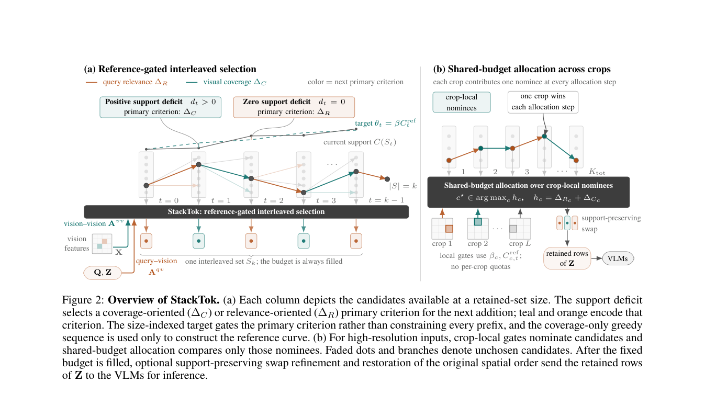

# StackTok: Accelerating VLMs Inference with Budget-Adaptive Visual Token Selection

> **复现级别：L1 核心机制诊断。** 本地执行单 crop 的 reference-gated selector；未加载五个论文 VLM。

## 论文信息

| 字段 | 内容 |
|---|---|
| 论文链接 | [StackTok: Accelerating VLMs Inference with Budget-Adaptive Visual Token Selection](https://arxiv.org/abs/2609.16841) |
| 公司/机构 | Sichuan University（按第一作者署名单位） |
| 首次公开日期 | 2026-09-15（arXiv v1） |
| 原文开源代码 | 是：[https://github.com/wongzbb/StackToK](https://github.com/wongzbb/StackToK) |
| Adapter / 方法 | `stacktok` |
| 本地复现代码 | [`src/auto_research/foundation_latest_20260916_followup.py`](https://github.com/daiwk/auto-research/blob/main/src/auto_research/foundation_latest_20260916_followup.py) |

## 原始论文总结

### 背景与主要改动

把 query relevance 作为目标、coverage 作为随预算变化的支撑约束，逐步在两种选取准则间切换。

<!-- paper-figure:start -->
### 原论文关键图

> **原论文 Figure 2（关键图）**：展示原论文的训练流程与关键优化环节。图片来自[原论文](https://arxiv.org/abs/2609.16841)，版权归原作者所有；点击图片可查看来源。
<!-- paper-figure:end -->

### 核心公式与实现对应

本地 reference kernel 保留决定性的排序、门控、偏好方向、信用权重或状态转换，并输出可审计统计。三种子 fixture 用来验证不变量和边界，不把随机 mini-suite 分数解释成论文能力。

### 论文效果

论文中的准确率、速度、训练损失或 benchmark 结论只作为原文结果；本地结果不与其直接横比，也不外推线上收益。

## 本地复现

三种子结果见 [`metrics/mechanism-seeds42-44.json`](metrics/mechanism-seeds42-44.json)。统一 receipt 标记 `diagnostic_only=true`，不能进入正式能力排名。

## 复现边界

本地执行单 crop 的 reference-gated selector；未加载五个论文 VLM。
