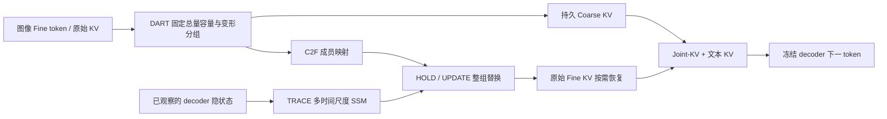
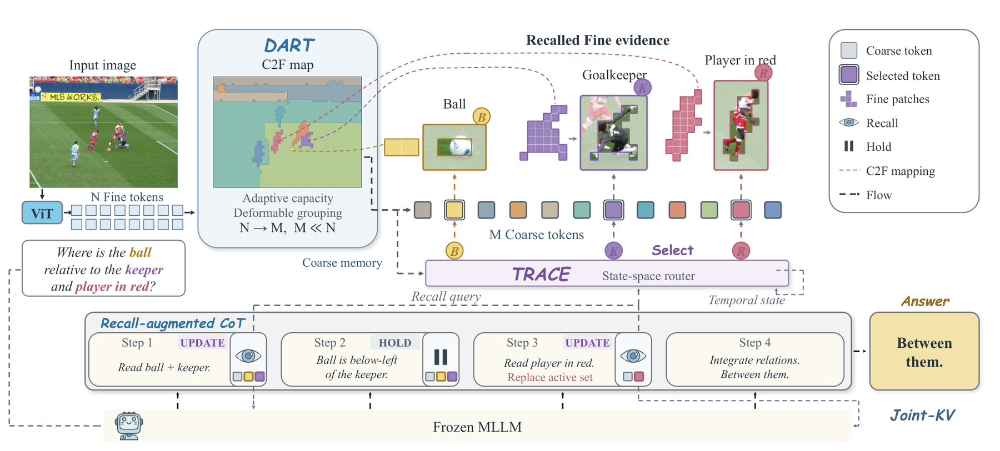

# ViMoD：可恢复视觉记忆与动态证据访问

## 论文信息

| 字段 | 内容 |
|---|---|
| 论文链接 | [Look Back, Think Ahead: Visual Memory on Demand for Efficient Multimodal Reasoning](https://arxiv.org/abs/2610.12060) |
| 一作机构/公司/学校 | Yicheng Xue；香港城市大学 / 浙江大学 |
| 首次公开日期 | 2026-10-08（arXiv v1） |
| 原作者代码 | 未找到作者公开代码 |
| Adapter | `vimod` |
| 本地代码 | `src/auto_research/multimodal/vimod.py`、`vimod_checkpoint.py` |
| 可运行入口 | `scripts/run_vimod_checkpoint.py` |

## 原始论文总结

### 背景与主要改动

一次性压缩图像可能丢掉后续推理需要的细节。DART 学习可变区域大小和成员，生成始终驻留的 Coarse KV；原始 Fine KV 仍保留。TRACE 根据已生成文本的因果隐状态决定保持或替换工作集，通过 Joint-KV 恢复原始细节。



<!-- paper-figure:start -->
### 原论文关键图

[](https://arxiv.org/html/2610.12060v1/method_overview.png)

> **原论文 Figure 4（关键图）**：展示原论文方法的总体设计和关键组成。图片来自[原论文](https://arxiv.org/abs/2610.12060)，版权归原作者所有；点击图片可查看来源。
<!-- paper-figure:end -->

### 核心公式

容量 $\tilde c_j=1+(U-1)\sigma(b_j+a_j+\mu)$，共享偏置约束 $\sum_j\tilde c_j=N$；隐式 Jacobian 为 $\operatorname{diag}(d)-dd^\top/\sum d$。按置信度分配后用 Sinkhorn 的连续容量提供跨组梯度，前向仍是硬分组。

训练池化权重 $W=W^{hard}+W^{soft}-sg(W^{soft})$，保留硬组内 softmax 梯度。TRACE 的各分支执行 $s_t=\rho_t s_{t-1}+(1-\rho_t)f(u_t)$；UPDATE 替换而非合并原工作集。

### 论文离线与线上效果

原文在 Qwen3-VL-4B 上报告八项视觉推理评测，20% 目标视觉预算下，相对其最佳一次性压缩对照的归一化平均分提高 39.0%。原文未报告线上 A/B。归一化基准是该论文自己的 Full 配置，不能混用官方模型卡分数。

## 本地复现

已实现 DART 容量约束/隐式梯度、总量整数舍入、置信度硬分组、八轮 Sinkhorn、共享 residual Value 编码；TRACE 层融合、四尺度 SSM、区域边界、HOLD/UPDATE 与真实 Fine KV 恢复。checkpoint backend 支持 SmolVLM/Idefics3，而非声称兼容 Qwen3-VL 的多模态 RoPE。

训练入口分四个阶段：`--phase dart`、`trace-set`、`trace-joint`、`trace-rl`。后续阶段必须显式提供上一阶段权重；SFT 必须提供 `evidence_by_segment` 的真实 Fine-index 标注，RL 必须提供实际在线 teacher 命令。teacher 仅接收图像、问题、生成前缀，不接收参考答案/未来文本。没有标注或 teacher 时会报错，不制造替代标签。

```bash
python scripts/prepare_scienceqa_vimod.py --output-directory data/vimod-scienceqa-train
PYTHONPATH=src python scripts/run_vimod_checkpoint.py \
  --checkpoint checkpoints/smolvlm2-256m \
  --checkpoint-id HuggingFaceTB/SmolVLM2-256M-Video-Instruct \
  --checkpoint-revision 067788b187b95ebe7b2e040b3e4299e342e5b8fd \
  --train-jsonl data/vimod-scienceqa-train/train.jsonl \
  --dataset-id derek-thomas/ScienceQA \
  --dataset-revision f18b0a70359ebfb41f658fd564208d0355b013f4 \
  --phase dart --steps 2 --seed 42 --device cuda --output runs/vimod-42.json
```

### 数据协议与结果

只用 ScienceQA **train** 的一份公开监督样本执行 runtime 验证；标签仅参与监督损失，不放入推理问题。A100 上真实 SmolVLM checkpoint 完成 DART 两步反向传播及动态 Joint-KV 解码，损失为 13.7315、13.7025。没有隔离测试能力分数，不能声称准确率提升。

`scripts/validate_vimod_cuda_runtime.py` 另外在同一真实 checkpoint 上执行 TRACE 三阶段 CUDA 梯度诊断。它使用**明确声明的合成辅助区域标注和全失败奖励 fixture**，不读取答案；VLM、因果缓存、循环 policy 和损失本身均实际执行。它仅验证训练接口和梯度，不是官方 teacher 或能力实验。

| 阶段 | 梯度范数 | 参数更新范数 |
|---|---:|---:|
| TRACE Set | 21.8409 | 0.02586 |
| TRACE Joint | 56.3908 | 0.02142 |
| TRACE RL | 7.8128 | 0.02586 |

### 代码映射与边界

`vimod.py` 实现公式算子；`vimod_checkpoint.py` 实现各层实际缓存分离与逐步生成、DART distillation、TRACE SFT 与 on-policy RL。固定总量梯度通过数值 gradcheck。

当前已验证 DART、动态解码和 TRACE 三阶段受控 CUDA 更新；真实上游证据标注、实际在线 teacher 的完整训练链路尚待实验。不能把梯度诊断等同于原文完整复现。原文的 Qwen3-VL、57K/80K/4.8K 训练配方、16项评测和预算校准未复刻。本地根据 SmolVLM 的实际 pixel-shuffle 配置重建每个 crop 的二维 patch 网格，以 2×2 区域初始化，不跨 crop 合并；它不是 Qwen 的多模态坐标适配。随机/fixture TRACE 结果不能作为能力证据或 Evolve 晋级依据。
