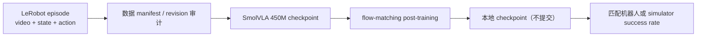

# 具身多模态后训练

`MM-003` 使用 Hugging Face 官方 [SmolVLA](https://huggingface.co/lerobot/smolvla_base)
与 [SVLA SO100 PickPlace](https://huggingface.co/datasets/lerobot/svla_so100_pickplace)
建立具身后训练入口。数据包含 50 个 episode、约 1.96 万帧的相机、关节状态和连续动作；
模型以多视角图像、状态和语言指令为条件，通过 flow matching 预测 action chunk。



先审计命令和本地数据，不启动训练：

```bash
auto-research embodied-post-train \
  --dataset-root data/svla_so100_pickplace \
  --checkpoint-path checkpoints/smolvla_base \
  --vlm-checkpoint-path checkpoints/SmolVLM2-500M-Video-Instruct \
  --offline --dry-run --device cuda \
  --steps 1 --batch-size 1
```

安装官方 `lerobot[smolvla]` 环境后去掉 `--dry-run` 即执行真实训练。输出
`metrics.json` 保存模型/数据 revision、数据 manifest SHA256、完整 argv、返回码和日志尾部；
原始视频、checkpoint 与训练日志不提交 Git。模型或数据快照下载失败时也会写入
`status=failed`、异常类型和错误消息，避免把 materialization 失败误记成没有运行。
SmolVLA 内部依赖的 `HuggingFaceTB/SmolVLM2-500M-Video-Instruct` 也固定到 40 位 commit；
离线运行必须显式传入它的本地 snapshot，不能只缓存外层 SmolVLA policy。
默认还把 SVLA 的 `top/wrist` 映射到 policy 的 `camera1/camera2`，并补一个 empty camera；
切换其他 LeRobot 数据集时用 `--rename-map` 与 `--empty-cameras` 显式覆盖，映射会进入指标。

A30 实测已完成 1 个真实视频 batch 的 CUDA 前向与反向：450,046,176 总参数中
99,880,992 个参与训练，step-1 loss 为 `0.297`、gradient norm 为 `6.400`，并成功保存本地
checkpoint。固定 revision、数据 manifest 和稳定摘要见
[`../experiments/roadmap-4-7.json`](../experiments/roadmap-4-7.json)。该结果只证明训练链路可用；
没有机器人或 simulator episode，因此没有 success rate，也不推断策略质量提升。

训练 loss 不能冒充机器人成功率。只有连接相同 SO100/SO101 硬件，或使用与 checkpoint
匹配的 RoboCasa/LIBERO 环境运行 episode，才报告 success rate；没有执行环境时状态明确写为
“训练链路验证”，不写成端到端具身能力。
