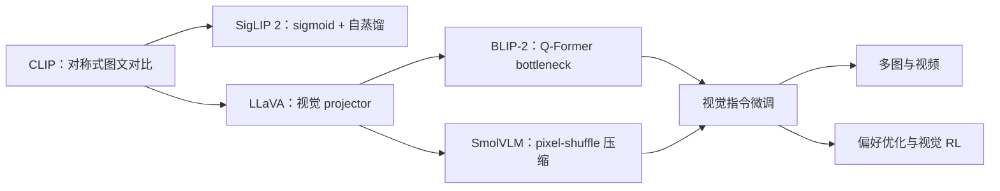

# 多模态大模型论文谱系与缺口

当前已完成连接器实验所需的训练/evolve 主链、L0 合成图、L1 Fashion-MNIST/CIFAR-10
公开图像协议，并把 CLIP、LLaVA、BLIP-2、SigLIP 2 与 SmolVLM 的核心算子接入独立
adapter 和统一 genome。下一缺口是 ScienceQA/POPE/COCO 等 L2 标准任务、多 seed 与
公开 checkpoint 对照；视频、音频、具身模型和大规模多模态后训练暂缓。
