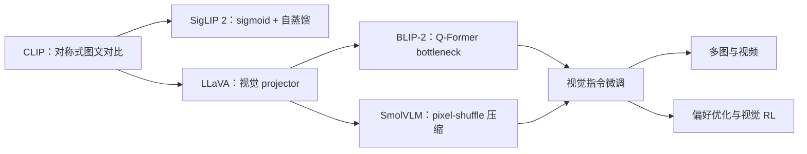

# 多模态大模型论文谱系与缺口

当前已完成连接器实验所需的训练/evolve 主链、L0 合成图、L1 Fashion-MNIST/CIFAR-10
公开图像协议，并把 CLIP、LLaVA、BLIP-2、SigLIP 2 与 SmolVLM 的核心算子接入独立
adapter 和统一 genome。MR3 补齐 ScienceQA/POPE/COCO/Flickr 的框架无关 L2 scorer、
固定预测协议和多 seed 置信区间；MR4 接入真实公开 checkpoint、不可变 revision、离线
snapshot 与逐条续跑；MR5 加入冻结 checkpoint 的 validation-only evolve 并回溯 GPU 路径；
MR6 补齐 CLIP/SigLIP 类 checkpoint 的 COCO/Flickr 双向检索预测及紧凑 rank 证据。
MR6 同时完成 ScienceQA 与 POPE 的完整 split 单 checkpoint 评测。MR7 已补齐跨 checkpoint
同预算矩阵和可选 `lmms-eval` 调用桥，MR8 完成自研 scorer 下的完整公平矩阵，MR9
进一步把上游结果解析为本仓库 schema-v2 证据，并真实执行标准任务。视频、音频、具身模型和大规模
多模态后训练暂缓。
