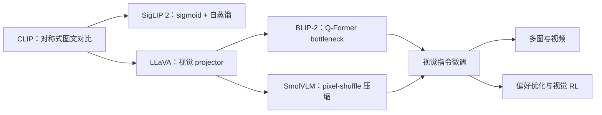

# 多模态大模型论文谱系与缺口

当前已完成连接器实验所需的训练/evolve 主链、L0 合成图、L1 Fashion-MNIST/CIFAR-10
公开图像协议，并把 CLIP、LLaVA、BLIP-2、SigLIP 2 与 SmolVLM 的核心算子接入独立
adapter 和统一 genome。MR3 又补齐 ScienceQA/POPE/COCO/Flickr 的框架无关 L2 scorer、
固定预测协议和多 seed 置信区间。当前真正的下一缺口是“公开 checkpoint 生成预测”而非
指标代码；没有真实 checkpoint 预测时，随机基线只算管线验证。视频、音频、具身模型和
大规模多模态后训练暂缓。
