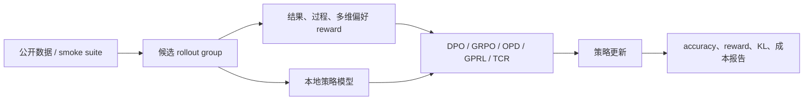

# LLM 后训练研究

这个子模块用于实现和比较最新的 RL、偏好优化和 on-policy distillation
方法。它与“模型结构 evolve”并列：前者改变训练目标和数据闭环，后者搜索网络结构。

当前实现统一使用候选策略模型，完整执行采样、策略概率、优势估计、KL 约束、
教师缓存和指标记录。默认 `arithmetic-smoke` 可在 Mac/Linux CPU 上几秒跑完；
`gsm8k-candidate` 会下载 OpenAI 官方 GSM8K，以可验证答案做公开数据实验。
它们属于**机制复现**，不能替代论文中的 8B/30B 全参数实验。



## 已实现方法

### Lightning OPD

- 论文：[arXiv 2604.13010](https://arxiv.org/abs/2604.13010)
- 作者机构：MIT HAN Lab / Jet AI
- 首次公开日期：2026-04-14
- 原作者代码：[jet-ai-projects/Lightning-OPD](https://github.com/jet-ai-projects/Lightning-OPD)
- 本地算法键：`lightning-opd`
- 本地代码：`src/auto_research/post_training/algorithms.py`

Lightning OPD 先对 SFT rollout 计算一次教师分布并缓存，训练期间不再调用在线教师：

$$
\mathcal{L}_{\mathrm{OPD}}
=-\mathbb{E}_{x,y\sim\mathcal{D}_{\mathrm{SFT}}}
\sum_t p_T(y_t\mid x,y_{<t})\log p_\theta(y_t\mid x,y_{<t}).
$$

本地实现记录 `teacher_prefill_calls`、`teacher_cache_entries` 和
`online_teacher_calls=0`，也固定同一个教师分布，显式落实论文的 teacher consistency。
论文在 Qwen3-8B Base 上报告 AIME 2024 69.9%，30 GPU hours，训练效率约 4 倍；
这不是本地 smoke 的对比基线。

### GPRL

- 论文：[arXiv 2605.18721](https://arxiv.org/abs/2605.18721)
- 作者机构：Stanford University / University of Oklahoma
- 首次公开日期：2026-05-18
- 原作者代码：截至 2026-07-27 未在论文页发布
- 本地算法键：`gprl`
- 本地代码：`src/auto_research/post_training/algorithms.py`

GPRL 对每个偏好维度独立做 group normalization，再聚合优势：

$$
\hat A_i^{(k)}=\frac{r_i^{(k)}-\mu_k}{\sigma_k+\epsilon},
\qquad A_i=\sum_k\lambda_k(x)\hat A_i^{(k)}.
$$

本地四个轴为 outcome、format、reasoning、brevity；drift monitor 在单轴漂移时
重新加权各轴并记录事件。论文报告 Llama-3-8B-Instruct 在 AlpacaEval 2.0
length-controlled win rate 56.51%。

### TCR

- 论文：[arXiv 2607.19824](https://arxiv.org/abs/2607.19824)
- 作者机构：论文作者团队（论文页未提供公司归属）
- 首次公开日期：2026-07-22
- 原作者代码：截至 2026-07-27 未发布
- 本地算法键：`tcr`
- 本地代码：`src/auto_research/post_training/algorithms.py`

TCR 用样本级 thinking checklist 产生过程奖励，并用 EMA 残差隔离结果奖励已能解释的部分：

$$
r_{\mathrm{TCR}}=r_{\mathrm{outcome}}
+\alpha\left(r_{\mathrm{process}}-\operatorname{EMA}(r_{\mathrm{outcome}})\right).
$$

本地过程 verifier 是可控的噪声 checklist 信号；报告会保存 outcome EMA 和
thinking surplus。论文报告在五个模型、三个模型家族上均有提升。

## 运行

```bash
# 无下载、跨平台快速验证
auto-research post-train --algorithm lightning-opd \
  --dataset arithmetic-smoke --steps 100 --seed 42

# 公开 GSM8K 候选排序
auto-research post-train --algorithm gprl \
  --dataset gsm8k-candidate --maximum-examples 512 --steps 300

auto-research post-train --algorithm tcr
auto-research post-train --algorithm dpo
auto-research post-train --algorithm grpo
```

每次运行独立写入 `runs/post-training/<algorithm>-<dataset>-seed<seed>/`，
包含 `metrics.json` 和 `report.md`，不保存或提交 checkpoint。

## 本地 smoke 结果

固定 `arithmetic-smoke`、512 个训练组、128 个验证组、300 steps、seed 42。
对照是同一个未训练候选策略，因此“相对变化”只表示本地机制验证，不对应论文基线。

| 方法 | 训练前 accuracy | 训练后 accuracy | 相对变化 |
|---|---:|---:|---:|
| DPO | 0.1953 | 0.6562 | +236.00% |
| GRPO | 0.1953 | 0.5312 | +172.00% |
| Lightning OPD | 0.1953 | 0.6562 | +236.00% |
| GPRL | 0.1953 | 0.2812 | +44.00% |
| TCR | 0.1953 | 0.6484 | +232.00% |

GPRL 在这个单一、可验证答案占主导的 smoke 数据上弱于 DPO/OPD，符合多维目标
会牺牲单一 accuracy 的预期；是否在开放式偏好上更好，需要后续接 AlpacaEval 类 judge。

### 公开 GSM8K 实验

同样固定 512/128 个 train/validation examples、300 steps、seed 42。这里评测的是
六候选 exact-answer 策略，不是自由生成 Pass@1。

| 方法 | accuracy | mean reward | KL(reference) |
|---|---:|---:|---:|
| 未训练策略 | 0.1641 | 0.3126 | 0.0000 |
| DPO | 0.8047 | 0.8347 | 0.0683 |
| GRPO | 0.8047 | 0.8348 | 1.1397 |
| Lightning OPD | **0.8359** | **0.8561** | 0.8269 |
| GPRL | 0.3672 | 0.5002 | 1.1022 |
| TCR | **0.8359** | 0.8560 | 0.5629 |

可机读的稳定指标保存在
[`docs/experiments/post-training-gsm8k-candidate-seed42.json`](experiments/post-training-gsm8k-candidate-seed42.json)。
