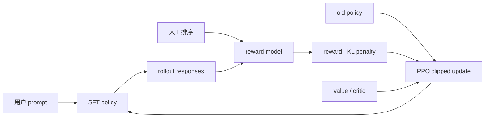

# InstructGPT / PPO-RLHF

> 本页实现 PPO-RLHF 的旧策略采样、clipped surrogate、独立 critic 与 KL 约束；
> 不把候选策略实验写成 175B InstructGPT 复刻。

## 论文信息

| 字段 | 内容 |
|---|---|
| 论文链接 | [Training language models to follow instructions with human feedback](https://arxiv.org/abs/2203.02155) |
| 公司 / 机构 | OpenAI |
| 首次公开日期 | 2022-03-04 |
| 原作者代码 | [部分开源](https://github.com/openai/following-instructions-human-feedback)：评测样例与模型卡；完整 SFT/RM/PPO 训练代码未发布 |
| 本地 adapter / CLI key | `ppo-rlhf` |
| 本地复现代码 | `src/auto_research/post_training/` |

## 原始论文总结

### 背景与主要改动

只扩大语言模型不能保证更符合用户意图。InstructGPT 建立了经典三阶段流程：先用
标注员示范做 SFT，再用成对排序训练 reward model，最后用 PPO 优化策略，同时以
KL 惩罚限制策略偏离 SFT/reference model。



### 核心公式

$$
\mathcal{L}_{\mathrm{clip}}(\theta)=
\mathbb{E}_t\left[
\min\left(r_t(\theta)\hat A_t,
\operatorname{clip}(r_t(\theta),1-\epsilon,1+\epsilon)\hat A_t\right)
\right],
\qquad
r_t(\theta)=\frac{\pi_\theta(a_t\mid s_t)}
{\pi_{\theta_{\mathrm{old}}}(a_t\mid s_t)}.
$$

本地实现由 critic 估计 baseline，并从 reward 中扣除相对 reference policy 的 KL。

### 论文离线与线上效果

论文的人类偏好评测中，1.3B InstructGPT 优于 175B GPT-3；175B InstructGPT 相对
175B GPT-3 的偏好率约为 85%（±3%）。TruthfulQA 真确性约翻倍，受尊重提示下
毒性降低约 25%。论文没有报告生产线上 A/B 流量实验。

## 本地复现

本地使用 OpenAI GSM8K 官方 JSONL 构造六候选策略任务，512/128
train/validation、300 steps、group size 4、seed 42。

| 指标 | 未训练策略 | PPO-RLHF |
|---|---:|---:|
| accuracy | 0.1641 | **0.8125** |
| mean reward | 0.3126 | **0.8335** |
| KL(reference) | 0.0000 | 0.8731 |

```bash
auto-research post-train --algorithm ppo-rlhf \
  --dataset gsm8k-candidate --maximum-examples 512 \
  --steps 300 --group-size 4 --seed 42 --offline
```

稳定指标：
[`classic-post-training-gsm8k-seed42.json`](../../experiments/classic-post-training-gsm8k-seed42.json)。

## 复现边界

保留 PPO 的 actor/old-policy/critic/clip/KL 更新结构，但策略是可解释的候选线性
policy，reward 来自确定性结果与过程轴；未训练 GPT-3、reward model，也未使用
OpenAI 私有 prompt 和人工标注数据。
