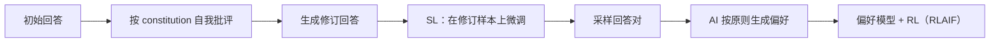

# Constitutional AI：从 AI 反馈学习无害性

> 本页复现“自我批评与修订 → 修订样本 SFT → AI 偏好 RLAIF”两阶段机制；本地
> candidate policy 不冒充 Anthropic 原始大模型安全训练。

## 论文信息

| 字段 | 内容 |
|---|---|
| 论文链接 | [Constitutional AI: Harmlessness from AI Feedback](https://arxiv.org/abs/2212.08073) |
| 公司 / 机构 | Anthropic |
| 首次公开日期 | 2022-12-15 |
| 原作者代码 | [补充材料已开源](https://github.com/anthropics/ConstitutionalHarmlessnessPaper)；不是完整训练框架 |
| 本地 adapter / CLI key | `constitutional-ai` |
| 本地复现代码 | `src/auto_research/post_training/` |

## 原始论文总结

### 背景与主要改动

人工逐条标注有害回答成本高，而且价值规范不透明。论文把人类监督压缩成一组自然语言
原则：第一阶段让模型依据原则批评并重写自己的回答，再对修订回答做 SFT；第二阶段让
AI 比较回答、训练 preference model，并以该奖励执行 RLAIF。



### 核心公式

$$
\mathcal L_{\mathrm{CAI}}
=-\log \pi_\theta(y_{\mathrm{rev}}\mid x)
-\lambda\log\sigma\!\left(
\beta\Delta\log\frac{\pi_\theta}{\pi_{\mathrm{ref}}}
\right),
$$

其中第一项对应修订回答 SFT，第二项的 chosen/rejected 来自按 constitution 生成的
AI 偏好。

### 论文离线与线上效果

论文的人类评测显示 RLAIF 模型能在保持 helpfulness 的同时降低 harmfulness，并比
只做 SL 的版本更少采取回避式拒答；chain-of-thought 式原则判断进一步改善透明度。
论文没有生产线上 A/B 实验。

## 本地复现

公开 GSM8K candidate 512/128、300 steps、seed 42。四个可审计原则维度用于批评/
修订和 AI preference；不读取人工 preference label。

| 指标 | 未训练策略 | Constitutional AI |
|---|---:|---:|
| accuracy | 0.1641 | **0.8438** |
| mean reward | 0.3126 | **0.8617** |
| KL(reference) | 0.0000 | 1.0214 |

```bash
auto-research post-train --algorithm constitutional-ai \
  --dataset gsm8k-candidate --maximum-examples 512 \
  --steps 300 --seed 42 --offline
```

稳定指标：
[`p0-missing-post-training-gsm8k-seed42.json`](../../experiments/p0-missing-post-training-gsm8k-seed42.json)。

## 复现边界

实现显式原则打分、自我修订 SFT 和 AI preference ranking 的状态更新；GSM8K 的
原则维度是正确性、格式、过程和简洁性，不是安全红队数据，也未训练独立 preference
model 或执行大模型 PPO。
