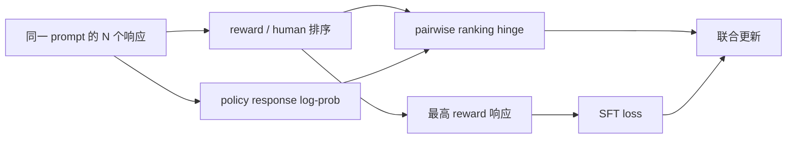

# RRHF：按奖励排序响应概率

> 本页实现全候选 reward ordering、response log-probability ranking loss 与
> best-response SFT，不把它简化成单个 chosen/rejected 的 DPO。

## 论文信息

| 字段 | 内容 |
|---|---|
| 论文链接 | [RRHF: Rank Responses to Align Language Models with Human Feedback without tears](https://arxiv.org/abs/2304.05302) |
| 公司 / 机构 | Alibaba DAMO Academy / Tsinghua University |
| 首次公开日期 | 2023-04-11 |
| 原作者代码 | [已开源](https://github.com/GanjinZero/RRHF) |
| 本地 adapter / CLI key | `rrhf` |
| 本地复现代码 | `src/auto_research/post_training/` |

## 原始论文总结

### 背景与主要改动

PPO-RLHF 需要 policy、old policy、reward 和 value 等多模型协同，训练和调参复杂。
RRHF 从多个模型或人工答案中采样响应，以 reward 给出完整排序，让模型自身的平均
log-likelihood 顺序与 reward 顺序一致，并对最高质量响应继续做 SFT。



### 核心公式

$$
\mathcal L_{\mathrm{rank}}
=\sum_{r_i<r_j}\max(0,p_i-p_j),\qquad
\mathcal L_{\mathrm{RRHF}}
=\mathcal L_{\mathrm{rank}}-\log\pi_\theta(y_{\arg\max r}\mid x).
$$

$p_i$ 是响应的长度归一化 log-probability。

### 论文离线与线上效果

论文在 Anthropic Helpful/Harmless 上报告 RRHF 的 reward-model 分数和人工偏好可与
PPO 相比；作者代码页给出的 Alpaca-RRHF reward 为 -1.02、Alpaca-PPO 为 -1.03。
论文没有生产线上 A/B 实验。

## 本地复现

公开 GSM8K candidate 512/128、300 steps、seed 42；每组 6 个响应均进入 reward
排序和违序 pair 统计。

| 指标 | 未训练策略 | RRHF |
|---|---:|---:|
| accuracy | 0.1641 | **0.8125** |
| mean reward | 0.3126 | **0.8401** |
| KL(reference) | 0.0000 | 0.8344 |

```bash
auto-research post-train --algorithm rrhf \
  --dataset gsm8k-candidate --maximum-examples 512 \
  --steps 300 --seed 42 --offline
```

稳定指标：
[`p0-missing-post-training-gsm8k-seed42.json`](../../experiments/p0-missing-post-training-gsm8k-seed42.json)。

## 复现边界

保留全排序 hinge 与 best-response SFT；候选 log-probability 是可审计策略概率，
没有训练 7B LLaMA，也没有复刻 HH 数据生成、外部 reward model 或人工评价。
