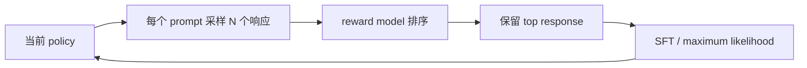
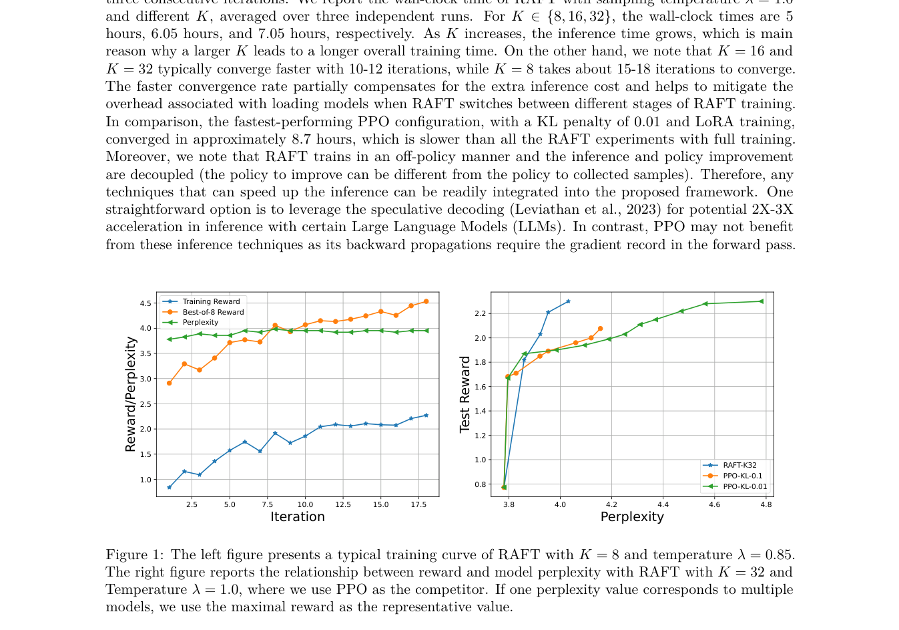

# RAFT：Reward Ranked Fine-Tuning

> 本页实现“当前策略采样 → reward 选优 → 只在保留响应上 SFT → 再采样”的迭代
> rejection-sampling 路径，和 RRHF 的全排序 loss 分开。

## 论文信息

| 字段 | 内容 |
|---|---|
| 论文链接 | [RAFT: Reward rAnked FineTuning for Generative Foundation Model Alignment](https://arxiv.org/abs/2304.06767) |
| 公司 / 机构 | HKUST / University of Illinois Urbana-Champaign |
| 首次公开日期 | 2023-04-13 |
| 原作者代码 | [已集成至作者团队 LMFlow](https://github.com/OptimalScale/LMFlow) |
| 本地 adapter / CLI key | `raft` |
| 本地复现代码 | `src/auto_research/post_training/` |

## 原始论文总结

### 背景与主要改动

PPO 的在线更新不稳定，而在固定 SFT 数据上训练又无法持续利用变好的策略。RAFT 每轮
从当前模型生成多个响应，用 reward model 排序并丢弃低质量样本，只对选中的高质量
响应执行普通 maximum-likelihood fine-tuning，然后用新策略进入下一轮。



<!-- paper-figure:start -->
### 原论文关键图

[](https://arxiv.org/pdf/2304.06767#page=8)

> **原论文 Figure 1（关键图）**：展示原论文的训练流程与关键优化环节。图片来自[原论文](https://arxiv.org/abs/2304.06767)，版权归原作者所有；点击图片可查看来源。
<!-- paper-figure:end -->

### 核心公式

$$
y^\star=\arg\max_{y\in\mathcal S_x}r(x,y),\qquad
\theta_{t+1}=\arg\min_\theta
-\mathbb E_x\log\pi_\theta(y^\star\mid x).
$$

### 论文离线与线上效果

论文在语言模型的 sentiment/reward alignment 和图像生成任务上均改善 reward 与自动
指标，并强调训练稳定性和较低资源需求；没有生产线上 A/B 实验。

## 本地复现

公开 GSM8K candidate 512/128、300 steps、seed 42；每次按当前策略无放回采样 4 个
响应，只保留 reward 最高的 1 个（keep ratio 0.25）做 SFT。

| 指标 | 未训练策略 | RAFT |
|---|---:|---:|
| accuracy | 0.1641 | **0.8438** |
| mean reward | 0.3126 | **0.8617** |
| KL(reference) | 0.0000 | 0.8789 |

```bash
auto-research post-train --algorithm raft \
  --dataset gsm8k-candidate --maximum-examples 512 \
  --steps 300 --group-size 4 --seed 42 --offline
```

稳定指标：
[`p0-missing-post-training-gsm8k-seed42.json`](../../experiments/p0-missing-post-training-gsm8k-seed42.json)。

## 复现边界

实现在线采样、reward ranking、top-response filtering 和迭代 SFT；未训练真实生成式
LLM/reward model，也未复刻扩散模型实验。候选策略结果只验证算法状态转移。
