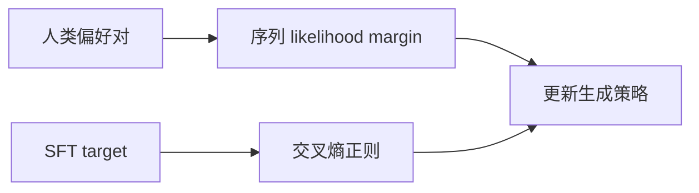

# SLiC-HF：用序列概率校准学习人类偏好

> 本页复现“偏好序列 margin 校准 + SFT 正则”目标，不把 candidate policy
> 写成原论文的 T5-XXL 实验。

## 论文信息

| 字段 | 内容 |
|---|---|
| 论文链接 | [SLiC-HF](https://arxiv.org/abs/2305.10425) |
| 公司 / 机构 | Google DeepMind / Google Research |
| 首次公开日期 | 2023-05-17 |
| 原作者代码 | 未发现原作者公开的独立实现 |
| 本地 adapter / CLI key | `slic-hf` |
| 本地复现代码 | `src/auto_research/post_training/` |

## 原始论文总结

### 背景与主要改动

PPO-RLHF 需要策略、reward 和 value 等多套模型。SLiC-HF 直接要求偏好回答的
序列 log-likelihood 高于拒绝回答，并用监督目标限制策略漂移；也能消费为其他模型
采集的 off-policy 偏好数据。



### 核心公式

$$
\mathcal L_{\mathrm{SLiC-HF}}
=\max\!\left(0,\delta-\log \pi_\theta(y^+\mid x)
+\log \pi_\theta(y^-\mid x)\right)
-\lambda\log \pi_\theta(y_{\mathrm{ref}}\mid x).
$$

### 论文离线与线上效果

Reddit TL;DR 上，T5-Large SLiC-HF（ranking 版本）在人评中以 66% 对 34%
胜过论文引用的 6B PPO-RLHF；四路人评中 SLiC-HF 被选为最佳的比例为 73%。
论文没有生产线上 A/B。

## 本地复现

GSM8K candidate 512/128、300 steps、seed 42，共享同一未训练策略基线。

| 指标 | 未训练策略 | SLiC-HF |
|---|---:|---:|
| accuracy | 0.1641 | **0.7812** |
| mean reward | 0.3126 | **0.8074** |
| KL(reference) | 0.0000 | 0.2512 |

```bash
auto-research post-train --algorithm slic-hf --dataset gsm8k-candidate \
  --maximum-examples 512 --steps 300 --seed 42 --offline
```

稳定指标：
[`p1-alignment-candidates-gsm8k-seed42.json`](../../experiments/p1-alignment-candidates-gsm8k-seed42.json)。

## 复现边界

实现 sequence margin、off-policy preference 标记和参考分布正则；候选项代表完整
回答，未训练 T5、独立 ranker，也未复刻 TL;DR 人评。
