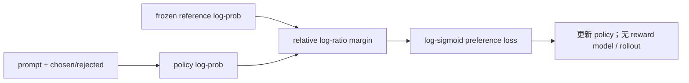
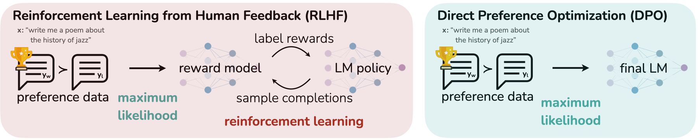

# DPO：Direct Preference Optimization

> 本页实现 chosen/rejected 相对 reference policy 的闭式偏好分类目标，不训练显式
> reward model，也不进行在线 rollout。

## 论文信息

| 字段 | 内容 |
|---|---|
| 论文链接 | [Direct Preference Optimization: Your Language Model is Secretly a Reward Model](https://arxiv.org/abs/2305.18290) |
| 公司 / 机构 | Stanford University |
| 首次公开日期 | 2023-05-29 |
| 原作者代码 | [已开源](https://github.com/eric-mitchell/direct-preference-optimization) |
| 本地 adapter / CLI key | `dpo` |
| 本地复现代码 | `src/auto_research/post_training/` |

## 原始论文总结

### 背景与主要改动

传统 RLHF 先拟合 reward model，再用 PPO 优化策略，链路复杂且不稳定。DPO 从
KL-regularized RLHF 的最优策略形式出发，把隐式 reward 写成 policy 与 reference
log-ratio，最终只需在偏好对上做二分类。



<!-- paper-figure:start -->
### 原论文关键图

[](https://ar5iv.labs.arxiv.org/html/2305.18290/assets/figures/diagrams/teaser.png)

> **原论文 Figure 1（关键图）**：展示原论文方法的总体设计和关键组成。图片来自[原论文](https://arxiv.org/abs/2305.18290)，版权归原作者所有；点击图片可查看来源。
<!-- paper-figure:end -->

### 核心公式

$$
\mathcal L_{\mathrm{DPO}}(\theta)=-
\mathbb E\log\sigma\left(
\beta\log\frac{\pi_\theta(y_w\mid x)}{\pi_{\mathrm{ref}}(y_w\mid x)}
-\beta\log\frac{\pi_\theta(y_l\mid x)}{\pi_{\mathrm{ref}}(y_l\mid x)}
\right).
$$

### 论文离线与线上效果

论文在情感控制上超过 PPO-based RLHF，在摘要和单轮对话中达到或超过 PPO，同时
显著简化训练。论文报告的是离线自动/人工评测，没有生产线上 A/B 实验。

## 本地复现

统一 GSM8K candidate 协议下，每题以 gold candidate 为 chosen、当前最高分错误项
为 rejected，并记录 reference-corrected preference margin。

| 指标 | 未训练策略 | DPO |
|---|---:|---:|
| accuracy | 0.1641 | **0.8047** |
| mean reward | 0.3126 | **0.8347** |
| KL(reference) | 0.0000 | 0.0683 |

```bash
auto-research post-train --algorithm dpo \
  --dataset gsm8k-candidate --maximum-examples 512 \
  --steps 300 --seed 42 --offline
```

稳定指标：
[`classic-post-training-gsm8k-seed42.json`](../../experiments/classic-post-training-gsm8k-seed42.json)。

## 复现边界

实现 DPO 的 reference-relative pairwise loss 与偏好 margin；候选策略可以精确计算
整项概率，但没有训练自回归 LLM，也没有复刻 Anthropic HH 或 TL;DR 偏好数据。
