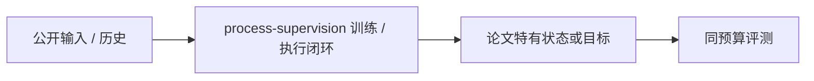
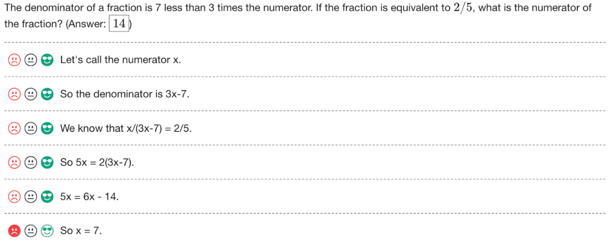

# Let's Verify Step by Step：过程监督与主动标注

> **保真度：核心机制复现**。本页不把确定性 mini-suite 冒充原论文完整 benchmark。

## 论文信息

| 字段 | 内容 |
|---|---|
| 论文链接 | [Let's Verify Step by Step：过程监督与主动标注（arXiv 2305.20050）](https://arxiv.org/abs/2305.20050) |
| 公司 / 机构 | OpenAI |
| 首次公开日期 | 2023-05-31（arXiv v1） |
| 原作者代码 | [已开源 PRM800K 数据](https://github.com/openai/prm800k) |
| 本地 adapter / 方法键 | `process-supervision` |
| 本地复现代码 | [`src/auto_research/post_training/`](https://github.com/daiwk/auto-research/tree/main/src/auto_research/post_training/) |

## 原始论文总结

### 背景与主要改动

逐步奖励模型判断每个推理步骤，并优先标注不确定步骤；本地与 outcome-only 奖励使用同一候选和预算。



<!-- paper-figure:start -->
### 原论文关键图

[](https://ar5iv.labs.arxiv.org/html/2305.20050/assets/figures/data_interface_simple.png)

> **原论文 Figure 1（关键图）**：展示原论文方法的总体设计和关键组成。图片来自[原论文](https://arxiv.org/abs/2305.20050)，版权归原作者所有；点击图片可查看来源。
<!-- paper-figure:end -->

### 核心公式

$$
\mathcal L_{PRM}=-\sum_t[y_t\log r_t+(1-y_t)\log(1-r_t)],\quad t^*=\arg\max_tH(r_t).
$$

### 论文离线与线上效果

过程监督模型在代表性 MATH 子集解出 78%，并优于 outcome supervision。 论文未报告生产线上 A/B，本页不补造线上数字。

## 本地复现

Arithmetic candidate suite、120 steps、256 examples、seed 42：accuracy 0.2344 → **0.5781（+146.67%）**；奖励、KL、长度和候选预算一致。

```bash
auto-research post-train --algorithm process-supervision --dataset arithmetic-smoke --maximum-examples 256 --steps 120 --seed 42
auto-research evolve --model post-training --dataset arithmetic-smoke --direction "组合 process-supervision 与已安装论文算子" --generations 2 --population 4
```

固定指标见 [`../../experiments/global-p0-20260808-seed42.json`](../../experiments/global-p0-20260808-seed42.json)。

## 复现边界

本地只验证论文特有目标、状态更新和公平预算；没有复刻原论文的大模型、多卡 RL、私有环境、真实网页或完整 benchmark，因而只报告机制验证，不声称数值复现原表。
