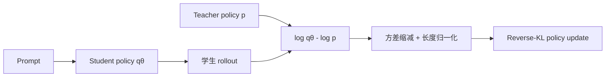
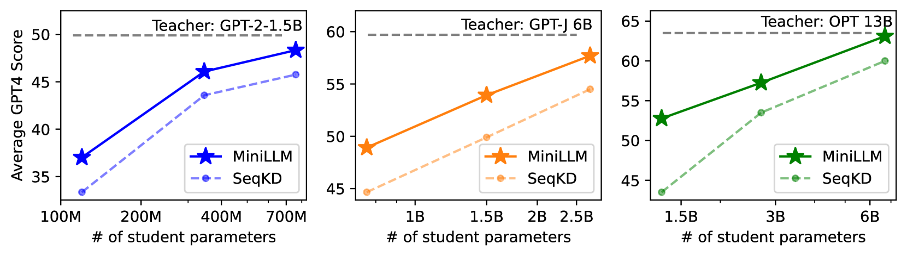

# MiniLLM：面向生成模型的 Reverse-KL 蒸馏

> 保真度：实现学生 rollout 上的 reverse KL、teacher-mixed sampling、方差缩减
> baseline 和长度归一化诊断；当前未训练论文中的 120M–13B 自回归模型。

## 论文信息

| 字段 | 内容 |
|---|---|
| 论文链接 | [MiniLLM: Knowledge Distillation of Large Language Models](https://arxiv.org/abs/2306.08543) |
| 公司 / 机构 | Tsinghua University / Microsoft Research |
| 首次公开日期 | 2023-06-14 |
| 原作者代码 | [microsoft/LMOps/minillm](https://github.com/microsoft/LMOps/tree/main/minillm) |
| 本地 adapter / 算法键 | `minillm` |
| 本地复现代码 | [`src/auto_research/post_training/`](https://github.com/daiwk/auto-research/tree/main/src/auto_research/post_training) |

## 原始论文总结

### 背景与主要改动

标准 forward KL 倾向覆盖教师所有概率质量，小学生可能因此高估教师的低概率区域。
MiniLLM 改用 mode-seeking 的 reverse KL，在学生自身生成分布上优化，并通过
teacher-mixed sampling、单步分解、长度归一化和 reward baseline 稳定策略梯度。



<!-- paper-figure:start -->
### 原论文关键图

[](https://arxiv.org/html/2306.08543v2/x1.png)

> **原论文 Figure 1**：展示 MiniLLM 与 SeqKD 在不同教师/学生规模组合上的效果。
> 图片来自[原论文](https://arxiv.org/abs/2306.08543)，版权归原作者所有。
<!-- paper-figure:end -->

### 核心公式

$$
\mathcal L_{\mathrm{MiniLLM}}
=D_{\mathrm{KL}}(q_\theta\Vert p_T)
=\mathbb E_{y\sim q_\theta}
\left[\log q_\theta(y|x)-\log p_T(y|x)\right].
$$

### 论文离线与线上效果

论文在 GPT-2、GPT-J、OPT 和 LLaMA 系列上报告比 SeqKD 更高的响应质量、更低暴露
偏差和更好的长文本表现；部分设置的 GPT-4 feedback 胜率达到 82.1%。这是公开离线
instruction-following 研究，没有生产线上 A/B。

## 本地复现

```bash
auto-research post-train --algorithm minillm \
  --dataset gsm8k-candidate --maximum-examples 128 \
  --steps 120 --seed 42
```

| 指标 | 未训练策略 | MiniLLM |
|---|---:|---:|
| validation accuracy | 0.2500 | **0.8750** |
| mean reward | 0.3732 | **0.8817** |
| KL(reference) | 0.0000 | 0.5477 |
| teacher mix / 在线教师打分 | — | 0.20 / 480 |

稳定指标见
[`classic-agentic-rl-opd-seed42.json`](../../experiments/classic-agentic-rl-opd-seed42.json)。

## 复现边界

候选策略可以验证 reverse KL 的采样与梯度方向，但没有真实 tokenizer、长文本生成和
GPT-4 judge。本地 accuracy 不是论文的生成质量分数。
