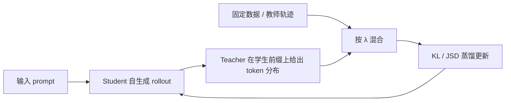
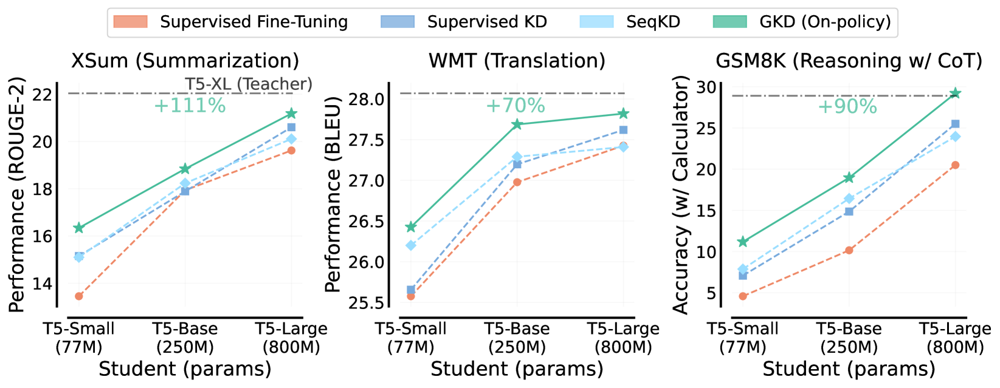

# GKD：从学生自身错误中学习的广义知识蒸馏

> 保真度：本地实现了学生 on-policy 采样、教师对学生访问状态打分、on/off-policy
> 混合和散度诊断；当前是候选策略机制复现，不等同于 T5-XL 到小模型的 token 级蒸馏。

## 论文信息

| 字段 | 内容 |
|---|---|
| 论文链接 | [On-Policy Distillation of Language Models: Learning from Self-Generated Mistakes](https://arxiv.org/abs/2306.13649) |
| 公司 / 机构 | Google DeepMind / Mila / University of Toronto |
| 首次公开日期 | 2023-06-23 |
| 原作者代码 | 原作者未发布独立代码仓库；[Hugging Face TRL 后续实现](https://github.com/huggingface/trl/blob/main/docs/source/distillation_trainer.md) |
| 本地 adapter / 算法键 | `gkd` |
| 本地复现代码 | [`src/auto_research/post_training/`](https://github.com/daiwk/auto-research/tree/main/src/auto_research/post_training) |

## 原始论文总结

### 背景与主要改动

固定教师轨迹会让学生训练时看到的前缀与推理时自身生成的前缀不一致。GKD 让学生生成
当前策略轨迹，再让教师在这些学生实际访问的状态给出完整分布；同时用
`student data fraction` 在固定数据和 on-policy 数据之间插值，并允许 forward KL、
reverse KL 或广义 JSD。



<!-- paper-figure:start -->
### 原论文关键图

[](https://arxiv.org/html/2306.13649v3/x1.png)

> **原论文 Figure 1**：比较固定轨迹 KD 与 on-policy GKD 在不同学生规模上的效果。
> 图片来自[原论文](https://arxiv.org/abs/2306.13649)，版权归原作者所有。
<!-- paper-figure:end -->

### 核心公式

$$
\mathcal L_{\mathrm{GKD}}(\theta)
=(1-\lambda)\mathbb E_{(x,y)\sim(X,Y)}
\mathcal D(p_T\Vert p_\theta)(y|x)
+\lambda\mathbb E_{x\sim X,y\sim p_\theta(\cdot|x)}
\mathcal D(p_T\Vert p_\theta)(y|x).
$$

### 论文离线与线上效果

论文报告，相对常用 KD 带来的增益，on-policy GKD 在摘要、翻译和算术推理上的平均
改进分别达到约 2.1×、1.7× 和 1.9×；任务无关蒸馏在 BBH 和 MMLU 上分别提高
2 和 1 个百分点。论文没有生产线上 A/B。

## 本地复现

```bash
auto-research post-train --algorithm gkd \
  --dataset gsm8k-candidate --maximum-examples 128 \
  --steps 120 --seed 42
```

| 指标 | 未训练策略 | GKD |
|---|---:|---:|
| validation accuracy | 0.2500 | **0.9375** |
| mean reward | 0.3732 | **0.9289** |
| KL(reference) | 0.0000 | 0.5122 |
| 学生 rollout / 在线教师打分 | — | 480 / 480 |

稳定指标见
[`classic-agentic-rl-opd-seed42.json`](../../experiments/classic-agentic-rl-opd-seed42.json)。

## 复现边界

本地候选项对应可审计的学生轨迹支撑集，教师分布由 GSM8K 结果与过程质量构造；没有
训练真实自回归 T5，也没有复跑 XSum/WMT。因此本地百分比只能验证数据流和目标函数，
不能与论文指标横向比较。
