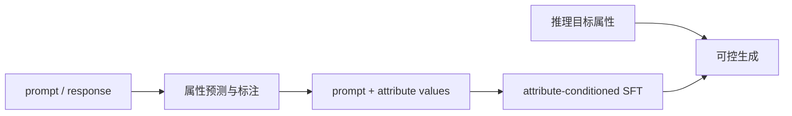

# SteerLM：多属性条件监督微调

> 本页复现显式属性标注、目标属性条件选择与 SFT 更新，不把四维本地属性冒充
> NVIDIA 43B 模型。

## 论文信息

| 字段 | 内容 |
|---|---|
| 论文链接 | [SteerLM](https://arxiv.org/abs/2310.05344) |
| 公司 / 机构 | NVIDIA |
| 首次公开日期 | 2023-10-09 |
| 原作者代码 | [NVIDIA NeMo-Aligner](https://github.com/NVIDIA/NeMo-Aligner) |
| 本地 adapter / CLI key | `steerlm` |
| 本地复现代码 | `src/auto_research/post_training/` |

## 原始论文总结

### 背景与主要改动

传统 RLHF 把多维偏好压成一个 reward，用户推理时也不能改变目标。SteerLM 先用
attribute prediction model 为回答标注 helpfulness、quality 等属性，再把属性和值
拼入条件做普通 SFT，推理时由用户指定目标属性。



### 核心公式

$$
\mathcal L_{\mathrm{SteerLM}}
=-\sum_t\log \pi_\theta
\left(y_t\mid x,\mathbf a,y_{<t}\right),
\qquad \mathbf a=(a_1,\ldots,a_K).
$$

### 论文离线与线上效果

Vicuna 80 prompts 的 GPT-4 评测中，SteerLM 43B 得到 ChatGPT-3.5 分数的
104.2%；人评 Elo 为 1040，高于 ChatGPT-3.5 的 981 和 Guanaco-65B 的 977。
论文没有生产线上 A/B。

## 本地复现

四个 reward axis 作为可审计属性标注，目标属性向量参与响应选择，再执行条件 SFT。

| 指标 | 未训练策略 | SteerLM |
|---|---:|---:|
| accuracy | 0.1641 | **0.8516** |
| mean reward | 0.3126 | **0.8654** |
| KL(reference) | 0.0000 | 0.9112 |

```bash
auto-research post-train --algorithm steerlm --dataset gsm8k-candidate \
  --maximum-examples 512 --steps 300 --seed 42 --offline
```

稳定指标：
[`p1-alignment-candidates-gsm8k-seed42.json`](../../experiments/p1-alignment-candidates-gsm8k-seed42.json)。

## 复现边界

保留多维 annotation 与条件 SFT；本地属性来自公开候选数据的确定性 reward axes，
没有训练大属性预测器，也未实现真实文本 token 级条件生成。
