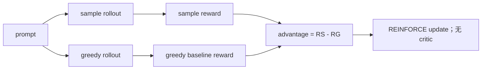

# ReMax

> 本页实现 ReMax 的 sampled rollout 减 greedy rollout baseline，验证无需价值网络
> 的低状态 RLHF 更新。

## 论文信息

| 字段 | 内容 |
|---|---|
| 论文链接 | [ReMax: A Simple, Effective, and Efficient Reinforcement Learning Method for Aligning Large Language Models](https://arxiv.org/abs/2310.10505) |
| 公司 / 机构 | 香港中文大学（深圳）/ 深圳市大数据研究院 / 南京大学 |
| 首次公开日期 | 2023-10-16 |
| 原作者代码 | [已开源](https://github.com/liziniu/ReMax) |
| 本地 adapter / CLI key | `remax` |
| 本地复现代码 | `src/auto_research/post_training/` |

## 原始论文总结

### 背景与主要改动

ReMax 利用 LLM RLHF 的三项特征：模拟快、token 转移确定、reward 通常只在轨迹末端
给出。它删除 PPO 的 value model，以当前策略 greedy decoding 的 reward 作
prompt-dependent baseline，降低 REINFORCE 方差。



### 核心公式

$$
\hat A(x,y)=r(x,y)-r\!\left(x,
\operatorname{Greedy}(\pi_\theta(\cdot\mid x))\right),
\qquad
\nabla_\theta J =
\mathbb E[\hat A(x,y)\nabla_\theta\log\pi_\theta(y\mid x)].
$$

### 论文离线与线上效果

论文报告训练 7B 模型时相对 PPO 节省约 46% GPU 显存；Mistral-7B 在
AlpacaEval 达到 94.78% win rate，MT-Bench 为 7.739。论文没有生产线上 A/B 实验。

## 本地复现

| 指标 | 未训练策略 | ReMax |
|---|---:|---:|
| accuracy | 0.1641 | **0.7031** |
| mean reward | 0.3126 | **0.7554** |
| KL(reference) | 0.0000 | 0.7939 |

```bash
auto-research post-train --algorithm remax \
  --dataset gsm8k-candidate --maximum-examples 512 \
  --steps 300 --group-size 4 --seed 42 --offline
```

稳定指标：
[`classic-post-training-gsm8k-seed42.json`](../../experiments/classic-post-training-gsm8k-seed42.json)。

## 复现边界

实现 sampled/greedy 双 rollout 与 value-free 更新；候选策略中的 greedy baseline
与自回归 greedy decoding 同构，但没有复刻 Mistral-7B、分布式训练或显存基准，
本地结果不能与 AlpacaEval 横向比较。
