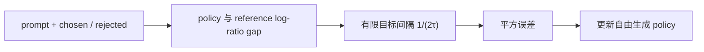

# Identity Preference Optimization（IPO）

> 用平方回归约束偏好 log-ratio，避免 DPO 在可分数据上把策略推向确定性极端。

## 论文信息

| 字段 | 内容 |
|---|---|
| 论文链接 | [A General Theoretical Paradigm to Understand Learning from Human Preferences](https://arxiv.org/abs/2310.12036) |
| 公司 / 机构 | Google DeepMind |
| 首次公开日期 | 2023-10-18 |
| 原作者代码 | 未发布 / 未发现独立官方仓库 |
| 本地 adapter / CLI key | `ipo` |
| 本地复现代码 | `src/auto_research/post_training/` |

## 原始论文总结

### 背景与主要改动

论文指出 RLHF 与 DPO 都依赖将成对偏好转成标量 reward 的假设，并提出直接在偏好
概率上优化的 $\Psi$PO 框架。取恒等映射得到 IPO：拟合一个有限的目标间隔，而不是
像 logistic loss 一样在训练集可分时持续放大 chosen/rejected 间隔。



### 核心公式

$$
\mathcal L_{\mathrm{IPO}}=
\left[
\log\frac{\pi_\theta(y_w|x)\pi_{\rm ref}(y_l|x)}
{\pi_\theta(y_l|x)\pi_{\rm ref}(y_w|x)}
-\frac{1}{2\tau}
\right]^2.
$$

### 论文离线与线上效果

原论文以理论分析和受控实验说明 IPO 相对 DPO 更有正则性并在部分示例上更优；
没有生产线上 A/B 实验。

## 本地复现

本地用字符 tokenizer、GRU causal LM 和自由生成 numeric verifier。SFT warmup 后，
正确 completion 为 chosen，当前 policy rollout 中最低 reward 响应为 rejected，
按 token log-probability 实现 reference-relative IPO。

```bash
auto-research post-train --algorithm ipo --dataset arithmetic-generate \
  --maximum-examples 48 --steps 6 --seeds 42,43,44 --offline
```

稳定指标：
[`free-generation-post-training-seeds42-44.json`](../../experiments/free-generation-post-training-seeds42-44.json)。

## 复现边界

保留了 tokenizer 级序列概率、自由生成、reference policy 与 IPO 平方目标；本地模型
和算术数据用于验证训练机制，不等同于论文的大模型偏好评测。
