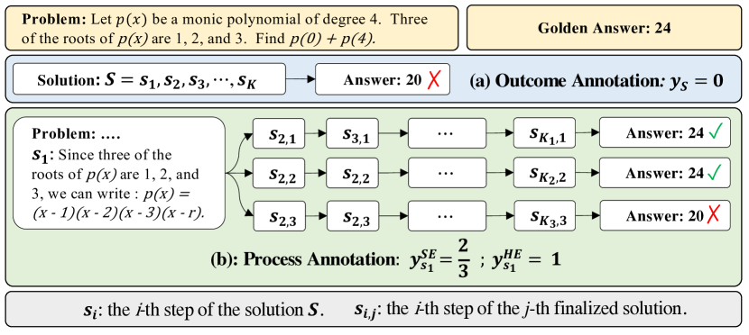

# Math-Shepherd：无需人工逐步标签的过程奖励

> **保真度：核心机制复现**。本页不把确定性 mini-suite 冒充原论文完整 benchmark。

## 论文信息

| 字段 | 内容 |
|---|---|
| 论文链接 | [Math-Shepherd：无需人工逐步标签的过程奖励（arXiv 2312.08935）](https://arxiv.org/abs/2312.08935) |
| 公司 / 机构 | Peking University / Alibaba Group |
| 首次公开日期 | 2023-12-14（arXiv v1） |
| 原作者代码 | 未发现/未发布原作者独立代码仓库 |
| 本地 adapter / 方法键 | `math-shepherd` |
| 本地复现代码 | [`src/auto_research/post_training/`](https://github.com/daiwk/auto-research/tree/main/src/auto_research/post_training/) |

## 原始论文总结

### 背景与主要改动

从中间步骤采样多条 continuation，以最终答案正确率构造自动 step label，再训练 verifier 和重排器。


<!-- paper-figure:start -->
### 原论文关键图

[](https://ar5iv.labs.arxiv.org/html/2312.08935/assets/x3.png)

> **原论文 Figure 2（关键图）**：展示原论文方法的总体设计和关键组成。图片来自[原论文](https://arxiv.org/abs/2312.08935)，版权归原作者所有；点击图片可查看来源。
<!-- paper-figure:end -->

### 核心公式

$$
v(s_t)=K^{-1}\sum_{k=1}^K\mathbf1[\operatorname{Ans}(\tau_k)=y^*],\quad\mathcal L=-\sum_t\operatorname{BCE}(r(s_t),v(s_t)).
$$

### 论文离线与线上效果

原文在 GSM8K/MATH 上提升多种 7B/13B 模型的生成与 reranking。 论文未报告生产线上 A/B，本页不补造线上数字。

## 本地复现

Arithmetic candidate suite、120 steps、256 examples、seed 42：accuracy 0.2344 → **0.6250（+166.67%）**；奖励、KL、长度和候选预算一致。

```bash
auto-research post-train --algorithm math-shepherd --dataset arithmetic-smoke --maximum-examples 256 --steps 120 --seed 42
auto-research evolve --model post-training --dataset arithmetic-smoke --direction "组合 math-shepherd 与已安装论文算子" --generations 2 --population 4
```

固定指标见 [`../../experiments/global-p0-20260808-seed42.json`](../../experiments/global-p0-20260808-seed42.json)。

## 复现边界

本地只验证论文特有目标、状态更新和公平预算；没有复刻原论文的大模型、多卡 RL、私有环境、真实网页或完整 benchmark，因而只报告机制验证，不声称数值复现原表。
