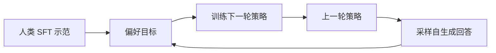
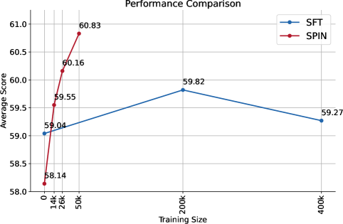

# SPIN：自博弈迭代微调

> 本页复现“上一轮策略生成负例、人与自生成回答对比、定期刷新对手”的迭代状态，
> 不把 candidate sampling 写成完整 LLM rollout。

## 论文信息

| 字段 | 内容 |
|---|---|
| 论文链接 | [SPIN](https://arxiv.org/abs/2401.01335) |
| 公司 / 机构 | University of California, Los Angeles |
| 首次公开日期 | 2024-01-02 |
| 原作者代码 | [uclaml/SPIN](https://github.com/uclaml/SPIN) |
| 本地 adapter / CLI key | `spin` |
| 本地复现代码 | `src/auto_research/post_training/` |

## 原始论文总结

### 背景与主要改动

额外偏好标注昂贵。SPIN 从 SFT 模型出发，用上一轮模型为训练 prompt 生成回答，
把人类示范视作正例、自生成回答视作负例，通过自博弈判别目标得到下一轮模型，循环
提升而不引入新的人工偏好数据。



<!-- paper-figure:start -->
### 原论文关键图

[](https://ar5iv.labs.arxiv.org/html/2401.01335/assets/x4.png)

> **原论文 Figure 4（关键图）**：展示原论文的训练流程与关键优化环节。图片来自[原论文](https://arxiv.org/abs/2401.01335)，版权归原作者所有；点击图片可查看来源。
<!-- paper-figure:end -->

### 核心公式

$$
\mathcal L_{\mathrm{SPIN}}
=-\log\sigma\!\left(
\lambda\log\frac{\pi_\theta(y_{\mathrm{data}}\mid x)}
{\pi_{\theta_t}(y_{\mathrm{data}}\mid x)}
-\lambda\log\frac{\pi_\theta(y_{\theta_t}\mid x)}
{\pi_{\theta_t}(y_{\theta_t}\mid x)}
\right).
$$

### 论文离线与线上效果

论文在 HuggingFace Open LLM Leaderboard、MT-Bench 与 BIG-Bench 上连续多轮提升；
在不增加 GPT-4 preference 数据的前提下，报告优于使用额外 GPT-4 偏好的 DPO
模型。论文没有生产线上 A/B。

## 本地复现

上一轮 candidate policy 负责采样负例，每 16 次更新刷新一次对手。

| 指标 | 未训练策略 | SPIN |
|---|---:|---:|
| accuracy | 0.1641 | **0.8594** |
| mean reward | 0.3126 | **0.8691** |
| KL(reference) | 0.0000 | 0.1294 |
| opponent refreshes | 0 | 18 |

```bash
auto-research post-train --algorithm spin --dataset gsm8k-candidate \
  --maximum-examples 512 --steps 300 --seed 42 --offline
```

稳定指标：
[`p1-alignment-candidates-gsm8k-seed42.json`](../../experiments/p1-alignment-candidates-gsm8k-seed42.json)。

## 复现边界

实现冻结对手、self-play sampling、reference-relative 偏好损失与轮次刷新；没有真实
文本生成、分布式训练或论文模型规模。
