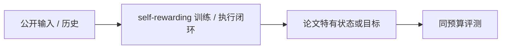
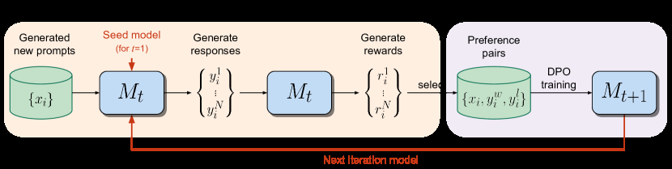

# Self-Rewarding LM：模型既生成回答也充当裁判

> **保真度：核心机制复现**。本页不把确定性 mini-suite 冒充原论文完整 benchmark。

## 论文信息

| 字段 | 内容 |
|---|---|
| 论文链接 | [Self-Rewarding LM：模型既生成回答也充当裁判（arXiv 2401.10020）](https://arxiv.org/abs/2401.10020) |
| 公司 / 机构 | Meta AI / New York University |
| 首次公开日期 | 2024-01-18（arXiv v1） |
| 原作者代码 | 未发现/未发布原作者官方训练仓库 |
| 本地 adapter / 方法键 | `self-rewarding` |
| 本地复现代码 | [`src/auto_research/post_training/`](https://github.com/daiwk/auto-research/tree/main/src/auto_research/post_training/) |

## 原始论文总结

### 背景与主要改动

每轮由当前模型生成候选并以 LLM-as-a-Judge 打分，形成新的偏好对继续 DPO，构成自举闭环。



<!-- paper-figure:start -->
### 原论文关键图

[](https://ar5iv.labs.arxiv.org/html/2401.10020/assets/x1.png)

> **原论文 Figure 1（关键图）**：展示原论文的训练流程与关键优化环节。图片来自[原论文](https://arxiv.org/abs/2401.10020)，版权归原作者所有；点击图片可查看来源。
<!-- paper-figure:end -->

### 核心公式

$$
D_{t+1}=D_t\cup\{(x,y^+,y^-):J_{\theta_t}(x,y^+)>J_{\theta_t}(x,y^-)\},\quad\theta_{t+1}=\operatorname{DPO}(D_{t+1}).
$$

### 论文离线与线上效果

三轮自奖励持续提升 instruction following 与 judge 能力；无生产 A/B。 论文未报告生产线上 A/B，本页不补造线上数字。

## 本地复现

Arithmetic candidate suite、120 steps、256 examples、seed 42：accuracy 0.2344 → **0.6250（+166.67%）**；奖励、KL、长度和候选预算一致。

```bash
auto-research post-train --algorithm self-rewarding --dataset arithmetic-smoke --maximum-examples 256 --steps 120 --seed 42
auto-research evolve --model post-training --dataset arithmetic-smoke --direction "组合 self-rewarding 与已安装论文算子" --generations 2 --population 4
```

固定指标见 [`../../experiments/global-p0-20260808-seed42.json`](../../experiments/global-p0-20260808-seed42.json)。

## 复现边界

本地只验证论文特有目标、状态更新和公平预算；没有复刻原论文的大模型、多卡 RL、私有环境、真实网页或完整 benchmark，因而只报告机制验证，不声称数值复现原表。
