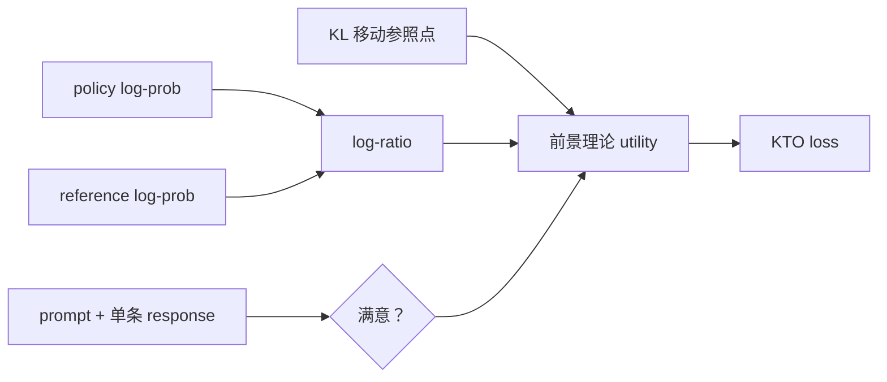

# KTO：无需偏好对的前景理论对齐

> KTO 只需要单条回答的“满意 / 不满意”标签，以 reference KL 为参照构造
> 前景理论效用，不要求同一 prompt 的 chosen/rejected 偏好对。

## 论文信息

| 字段 | 内容 |
|---|---|
| 论文链接 | [KTO: Model Alignment as Prospect Theoretic Optimization](https://arxiv.org/abs/2402.01306) |
| 公司 / 机构 | Contextual AI / Stanford University |
| 首次公开日期 | 2024-02-02 |
| 原作者代码 | [已开源：ContextualAI/HALOs](https://github.com/ContextualAI/HALOs) |
| 本地 adapter / CLI key | `kto` |
| 本地复现代码 | `src/auto_research/post_training/` |

## 原始论文总结

### 背景与主要改动

DPO 需要成对偏好，而生产反馈常只有点赞、点踩或是否接受。KTO 将单样本反馈映射为
desirable / undesirable utility，并用 policy 与 reference 的 KL 期望作为“参照点”；
两类样本可独立采集，也允许类别不平衡。



### 核心公式

$$
z(x)=D_{\mathrm{KL}}\!\left(\pi_\theta(\cdot|x)\Vert\pi_{\mathrm{ref}}(\cdot|x)\right),
\qquad
r_\theta(x,y)=\log\frac{\pi_\theta(y|x)}{\pi_{\mathrm{ref}}(y|x)},
$$

$$
v(x,y)=
\begin{cases}
\lambda_D\sigma\!\left(\beta(r_\theta-z)\right), & y\text{ desirable},\\
\lambda_U\sigma\!\left(\beta(z-r_\theta)\right), & y\text{ undesirable}.
\end{cases}
$$

### 论文离线与线上效果

论文在 1B–30B 模型上报告 KTO 可匹配或超过需要偏好对的基线，并研究反馈类别失衡；
结果来自离线语言模型评测，没有生产线上 A/B 实验。

## 本地复现

| 指标 | 未训练策略 | KTO |
|---|---:|---:|
| accuracy | 0.1641 | **0.8359** |
| mean reward | 0.3126 | **0.8560** |
| KL(reference) | 0.0000 | 0.0143 |

最后一步 desirable / undesirable utility 为 0.5030 / 0.4972，KL EMA 为 0.0074。

```bash
auto-research post-train --algorithm kto \
  --dataset gsm8k-candidate --maximum-examples 512 \
  --steps 300 --seed 42 --offline
```

稳定指标：
[`classic-post-training-gsm8k-seed42.json`](../../experiments/classic-post-training-gsm8k-seed42.json)。

## 复现边界

实现了单样本二元反馈、reference log-ratio、KL 移动参照点与两类 utility；本地 policy
是六候选线性策略，不是论文中的 1B–30B 自由生成 LLM，也未复刻人类偏好数据规模。
