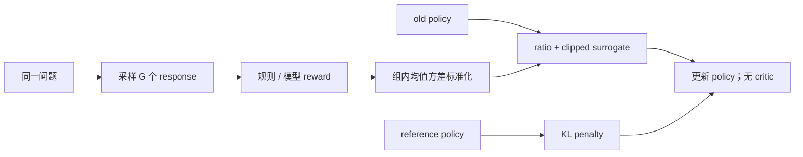
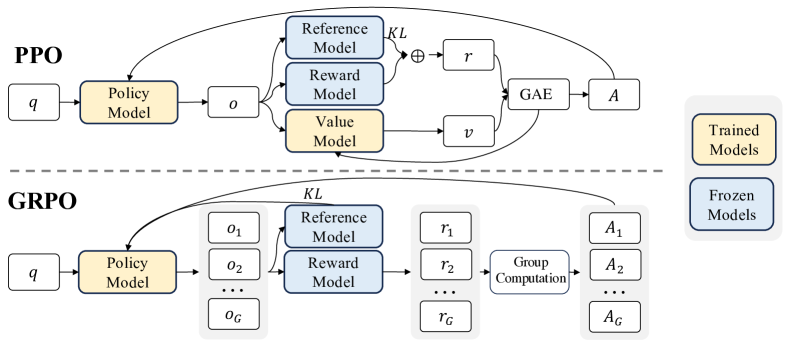

# DeepSeekMath / GRPO

> 本页实现 group-relative advantage、old-policy ratio、clipped surrogate 与
> reference KL，并验证无需 critic 的在线策略更新。

## 论文信息

| 字段 | 内容 |
|---|---|
| 论文链接 | [DeepSeekMath: Pushing the Limits of Mathematical Reasoning in Open Language Models](https://arxiv.org/abs/2402.03300) |
| 公司 / 机构 | DeepSeek-AI |
| 首次公开日期 | 2024-02-05 |
| 原作者代码 | [已开源](https://github.com/deepseek-ai/DeepSeek-Math) |
| 本地 adapter / CLI key | `grpo` |
| 本地复现代码 | `src/auto_research/post_training/` |

## 原始论文总结

### 背景与主要改动

PPO 的 value model 与 policy 同规模，数学推理 RL 训练显存昂贵。GRPO 对同一问题
采样一组 response，以组内 reward 均值和标准差构造 advantage，删除 critic；策略
部分仍使用 old policy ratio、clipping 与 reference KL。



<!-- paper-figure:start -->
### 原论文关键图

[](https://ar5iv.labs.arxiv.org/html/2402.03300/assets/x2.png)

> **原论文 Figure 4（关键图）**：展示原论文的训练流程与关键优化环节。图片来自[原论文](https://arxiv.org/abs/2402.03300)，版权归原作者所有；点击图片可查看来源。
<!-- paper-figure:end -->

### 核心公式

$$
\hat A_i=\frac{r_i-\operatorname{mean}(r_1,\ldots,r_G)}
{\operatorname{std}(r_1,\ldots,r_G)+\epsilon},
$$

$$
\mathcal J_{\mathrm{GRPO}}=
\frac1G\sum_i\min\left(
\rho_i\hat A_i,\operatorname{clip}(\rho_i,1-\epsilon,1+\epsilon)\hat A_i
\right)-\beta D_{\mathrm{KL}}(\pi_\theta\Vert\pi_{\mathrm{ref}}).
$$

### 论文离线与线上效果

DeepSeekMath 7B 在 MATH 达到 51.7%，64-sample self-consistency 为 60.9%；
论文将数学能力提升归因于 120B math token continued pretraining 与 GRPO。
没有生产线上 A/B 实验。

## 本地复现

| 指标 | 未训练策略 | GRPO |
|---|---:|---:|
| accuracy | 0.1641 | **0.7812** |
| mean reward | 0.3126 | **0.8169** |
| KL(reference) | 0.0000 | 1.0401 |

最后一步诊断包含 4 个 group samples、importance ratio、clip fraction；300 steps
期间刷新 old policy 18 次，value model 参数为 0。

```bash
auto-research post-train --algorithm grpo \
  --dataset gsm8k-candidate --maximum-examples 512 \
  --steps 300 --group-size 4 --seed 42 --offline
```

稳定指标：
[`classic-post-training-gsm8k-seed42.json`](../../experiments/classic-post-training-gsm8k-seed42.json)。

## 复现边界

保留 GRPO 的在线 group sampling、critic-free advantage、ratio clipping 和 KL；
本地 response 是六候选完整 action，未训练 DeepSeekMath 7B，也未复刻 120B token
预训练和自由生成数学 verifier。
