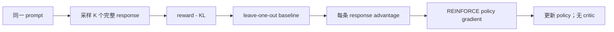

# RLOO：回到 REINFORCE 的 RLHF

> 本页实现完整响应级 REINFORCE、leave-one-out baseline 与 KL-shaped reward，
> 不引入 PPO critic。

## 论文信息

| 字段 | 内容 |
|---|---|
| 论文链接 | [Back to Basics: Revisiting REINFORCE Style Optimization for Learning from Human Feedback in LLMs](https://arxiv.org/abs/2402.14740) |
| 公司 / 机构 | Cohere For AI / Cohere |
| 首次公开日期 | 2024-02-22 |
| 原作者代码 | 未发布独立官方训练仓库；论文作者仅公开数据链接，TRL/OpenRLHF 后续提供第三方实现 |
| 本地 adapter / CLI key | `rloo` |
| 本地复现代码 | `src/auto_research/post_training/` |

## 原始论文总结

### 背景与主要改动

PPO 为一般长时域 RL 设计，价值网络、GAE 和多轮 clipping 给 LLM RLHF 带来较大
显存与调参开销。RLOO 把一整段 response 视作一个 action；同一 prompt 采样多个
response，用其余样本的平均 reward 作为当前样本 baseline。



### 核心公式

$$
\hat A_i =
\tilde r_i-\frac{1}{K-1}\sum_{j\ne i}\tilde r_j,
\qquad
\tilde r_i=r(x,y_i)-\beta\log
\frac{\pi_\theta(y_i\mid x)}{\pi_{\mathrm{ref}}(y_i\mid x)}.
$$

$$
\nabla_\theta J(\theta)\approx
\frac{1}{K}\sum_{i=1}^{K}\hat A_i
\nabla_\theta\log\pi_\theta(y_i\mid x).
$$

### 论文离线与线上效果

论文在 TL;DR、HH-Pythia、HH-Llama 三项评测报告 RLOO（K=4）win rate
77.9、43.7、64.1；对应 PPO 为 67.6、29.2、32.0，绝对提升
10.3、14.5、32.1 个百分点。论文没有生产线上 A/B 实验。

## 本地复现

与 PPO-RLHF 使用完全相同的 GSM8K candidate 数据、特征、reward、steps 与 seed。

| 指标 | 未训练策略 | RLOO |
|---|---:|---:|
| accuracy | 0.1641 | **0.8281** |
| mean reward | 0.3126 | **0.8509** |
| KL(reference) | 0.0000 | 0.5707 |

```bash
auto-research post-train --algorithm rloo \
  --dataset gsm8k-candidate --maximum-examples 512 \
  --steps 300 --group-size 4 --seed 42 --offline
```

稳定指标：
[`classic-post-training-gsm8k-seed42.json`](../../experiments/classic-post-training-gsm8k-seed42.json)。

## 复现边界

实现了 K=4 的 leave-one-out advantage、完整候选 action 和 KL shaping，且明确
不创建 value model；未复刻 6.9B/7B 模型、学习到的 reward model 与论文数据规模。
